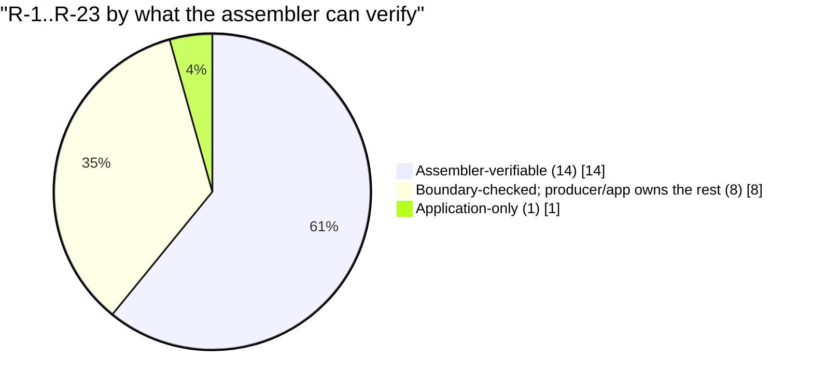
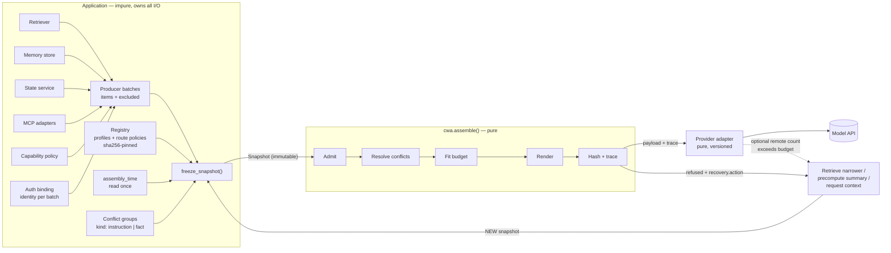
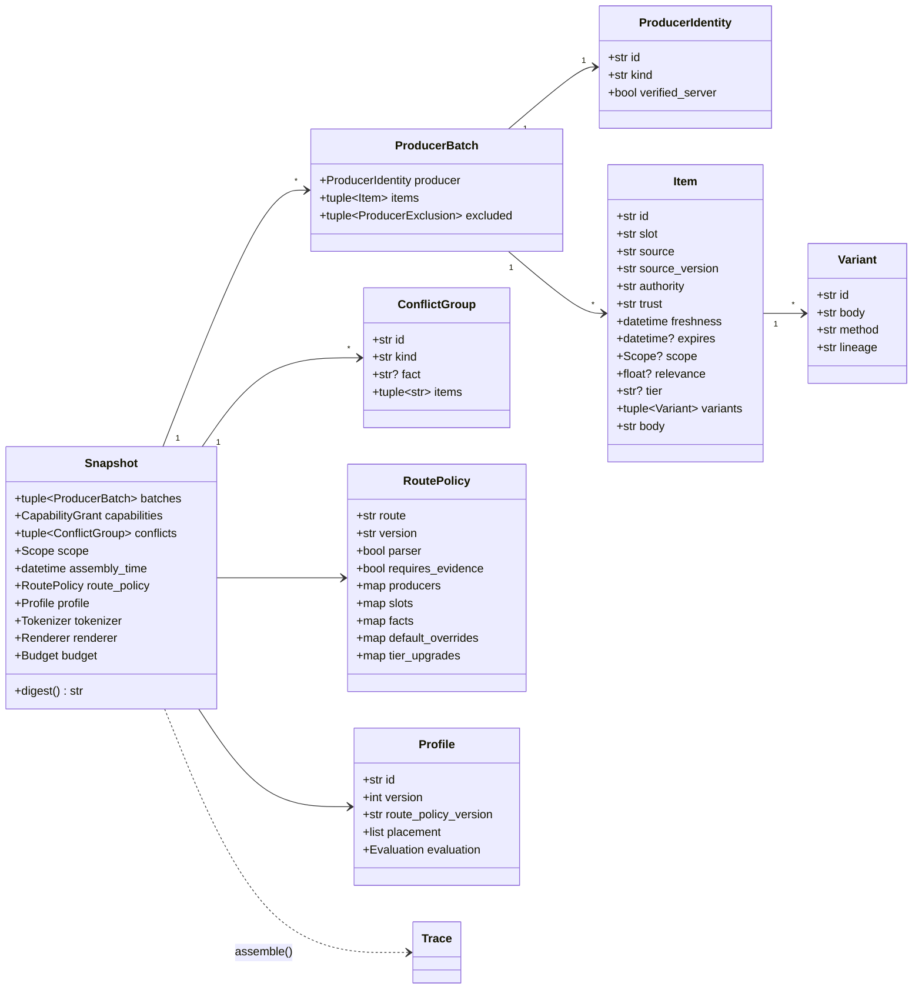
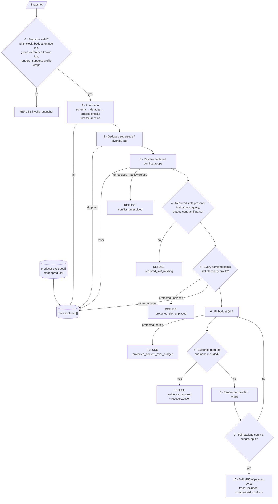
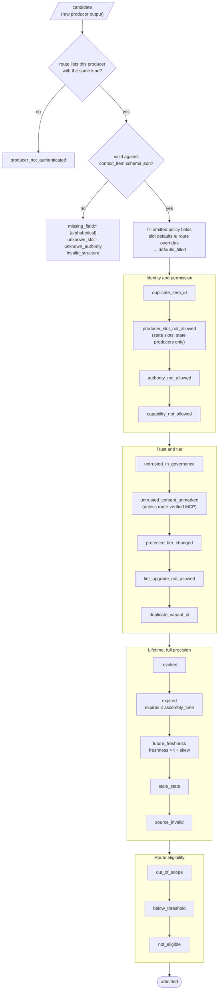
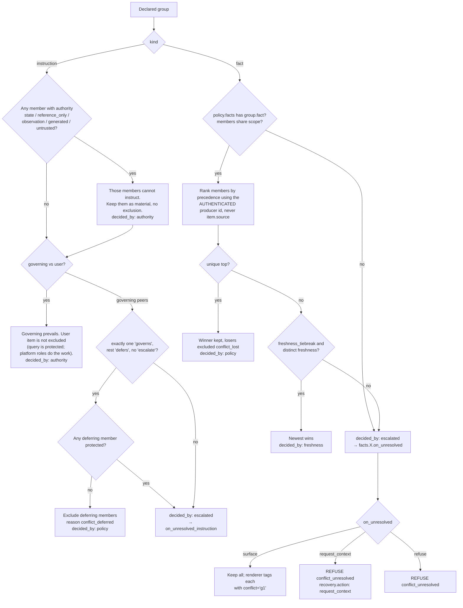
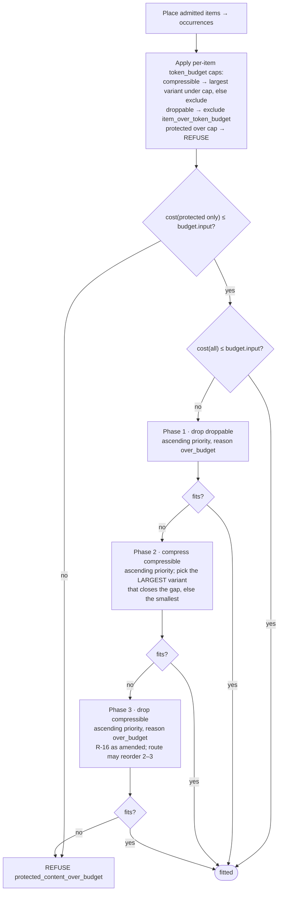
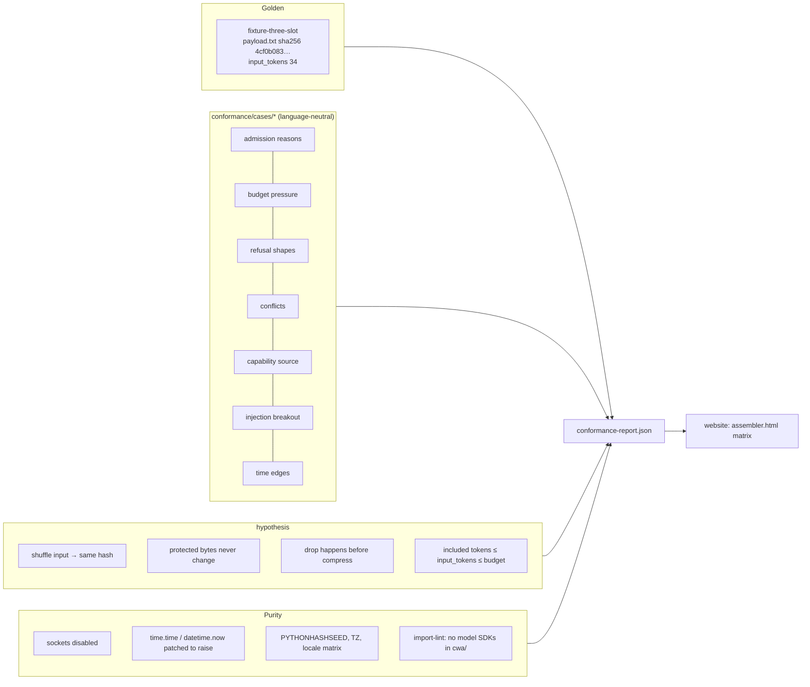
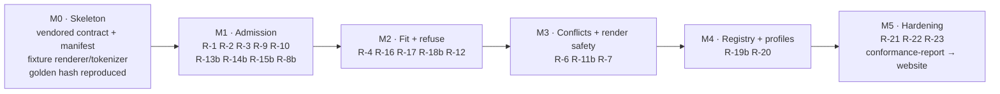

# CWA reference assembler: system design

**Status:** draft for review · **Date:** 2026-09-22 · **Spec target:** CWA v2 draft (R-1 to R-23)
**Inputs:** `website/SPEC.md`, `spec.html`, `producers.html`, `assembler.html`, `schema/*.schema.json`, `contract/slot-defaults.json`, `contract.js`, `examples/`

This document designs the Python reference assembler and tests whether the v2 draft can actually be built as written. It argues against the spec wherever the text leaves an implementer guessing. Findings are labelled **DA-n**, and decisions that need an owner are labelled **D-n** (§9).

---

## 0. Summary

**The spec can be built.** The central idea holds up: a pure function from an immutable snapshot to a payload and a trace. Nothing in R-1 to R-23 is impossible. But five gaps would force an implementer to invent behavior, and two implementations would invent it differently:

| # | Gap | Why it blocks code |
|---|-----|--------------------|
| DA-1 | "Rendered payload" is undefined for multi-channel requests (`wrap: system`, `wrap: tools`) | You cannot hash "exact bytes" until you define which bytes. Two profiles cannot be realized on a single-system-prompt API. |
| DA-2 | R-16 requires exact counts with the declared tokenizer, but R-23 forbids external reads | Some providers only offer token counting as a remote call, and the sum of per-part counts ≠ the count of the whole. |
| DA-3 | Fitting has no defined step after "compress" | With 30 retrieved passages, a literal reading refuses routine requests. The landing demo does exactly that. |
| DA-4 | The published API (`assembler.html`) has no `assembly_time`, conflicts, scope, producer identity, tokenizer or renderer | The API makes R-23 impossible to meet: those inputs would be ambient. |
| DA-5 | `assembly-sketch.txt` flattens items and producer context separately | This loses the item→producer binding that R-8 and R-15 rely on. |

**The "0 of 23" matrix can never honestly reach 23.** R-5 contains no clause the assembler can test. Eight more requirements are partly obligations on producers or the application (§1.4). The matrix needs a *scope* column, not just a status.

---

## 1. Requirements

### 1.1 Functional

The assembler turns an immutable **snapshot** into either `(payload bytes, trace)` or `(no payload, refusal trace)`. It admits items, resolves supplied conflict groups, fits items to a token budget by tier, renders them by profile, hashes the result and records every decision.

### 1.2 Non-functional

| Property | Target | Source |
|---|---|---|
| Determinism | Same snapshot → same payload bytes + SHA-256, or same refusal; invariant to input order, `PYTHONHASHSEED`, TZ and locale | R-23 |
| Purity | No network, no model, no clock, no filesystem inside `assemble()` | R-12, R-18, R-23 |
| Latency (proposed, unmeasured) | p99 < 50 ms for 200 items / 32k tokens with a local tokenizer | Assembly is on the request path. |
| Portability | Conformance fixtures are language-neutral JSON, so later ports reuse them | "Python first, others after conformance" |
| Contract fidelity | Validates against the published JSON Schemas, never against a re-encoded copy | Avoids drift between the website and the assembler. |

### 1.3 Constraints

- Python first (≥ 3.11). The core depends only on `jsonschema` and `rfc3339-validator` (see DA-17).
- The website repo stays the source of truth for schemas, slot defaults and requirement IDs. The assembler vendors a pinned copy.
- The assembler never calls a model, and neither do its tests.

### 1.4 Who each requirement actually binds

Honest conformance starts with admitting that the assembler cannot observe some clauses.



| Scope | Requirements | What the assembler can do |
|---|---|---|
| **Assembler** | R-1, 2, 3, 4, 6, 7, 10, 12, 16, 17, 20, 21, 22, 23 | Fully implement and test. |
| **Boundary** | R-8, 9, 11, 13, 14, 15, 18, 19 | Check the handoff: producer kind, `relevance` present, expiry, allow-list membership, profile evaluation gate. It cannot see whether a producer merged a blob (R-13), whether a variant introduced a new fact (R-18), or whether the app missed a conflict (R-11). |
| **Application** | R-5 | Document the obligation. Nothing to test. |

**Recommendation for `assembler.html`:** add a `scope` column and allow the statuses `planned · in progress · implemented · boundary-checked · application obligation`. Generate the matrix from a `conformance-report.json` that the assembler's test suite emits. Stop hardcoding `"planned"`.

---

## 2. High-level design

### 2.1 Context and the purity boundary

Everything impure happens *before* `freeze_snapshot()`. Everything after it is a pure function. A retry never mutates a snapshot; it builds a new one (R-12, R-23).



### 2.2 Revised API (replaces the `assembler.html` sketch, DA-4)

```python
from cwa import assemble, Snapshot, ProducerBatch, ProducerIdentity, CapabilityGrant, ConflictGroup, Scope, Budget
from cwa.registry import Registry
from cwa import renderers, tokenizers

reg = Registry.from_lockfile("cwa.lock.json")            # profiles + route policies, pinned by sha256

snapshot = Snapshot.freeze(
    batches=[                                             # identity is bound per BATCH by the app, never read from item.source
        ProducerBatch(producer=ProducerIdentity(id="policy-corpus", kind="retrieval"), items=..., excluded=...),
        ProducerBatch(producer=ProducerIdentity(id="memory-svc", kind="memory"),       items=..., excluded=...),
        ProducerBatch(producer=ProducerIdentity(id="cap-policy", kind="capability_policy"), items=..., excluded=...),
    ],
    capabilities=CapabilityGrant(policy_producer="cap-policy", allow_list_version="v3", allowed_ids=("cap:issue_refund",)),
    conflicts=[ConflictGroup(id="g1", kind="fact", fact="refund.window", items=("refunds-eu:v17#p4", "crm:order#42"))],
    scope=Scope(tenant="acme", user="u_91", session="s_7", task="refund_request"),
    assembly_time="2026-09-22T12:00:00Z",                 # explicit; the core never reads a clock
    route_policy=reg.policy("support-chat", "v2"),
    profile=reg.profile("policy-first-chat", 2),
    tokenizer=tokenizers.get("fixture-whitespace/v1"),
    renderer=renderers.get("cwa-text/v1"),
    budget=Budget(input=8192, reserved_output=1200),      # input is already net of reserved_output
)

result = assemble(snapshot)   # pure
result.refused                # bool
result.payload                # bytes | None
result.trace                  # dict, validates against trace.schema.json
snapshot.digest()             # sha256 of canonical snapshot JSON, the replay key
```

The snapshot stores the *outcome* of authentication (producer id, kind, verified flag), never credentials. Snapshots hold user content, so the app owns their retention policy. Traces carry IDs and never bodies.

### 2.3 Package layout

```
cwa/
  __init__.py          assemble, Snapshot, ...
  model.py             frozen dataclasses: Item, Variant, ProducerBatch, ProducerIdentity, ConflictGroup, Scope, Budget
  snapshot.py          freeze(), canonical JSON, digest()
  admission.py         ordered checks → Admitted | Exclusion
  conflicts.py         instruction + fact resolution
  fitting.py           tiered shedding, variant selection
  evidence.py          R-12 check + recovery mapping
  render/              Renderer protocol · fixture_xml.py · text.py · messages.py
  tokenize/            Tokenizer protocol · fixture_whitespace.py · estimate.py · tiktoken.py (extra)
  policy.py            RoutePolicy (declarative), predicates
  registry.py          lockfile, sha256 pins for profiles and policies (R-20)
  trace.py             TraceBuilder, schema validation, canonical ordering
  reasons.py           reason-code registry (mirrors contract/reasons.json, DA-13)
  contract/            vendored schemas, slot-defaults.json, requirements.json + MANIFEST.sha256
conformance/
  cases/<name>/{snapshot.json, expected.trace.json, expected.payload}   language-neutral
  runner.py            emits conformance-report.json → drives the website matrix
tests/                 unit + property (hypothesis) + purity guards
```

---

## 3. Data model



`ConflictGroup.id` and `ConflictGroup.fact` are **additions**. The schema today only implies `{kind, items}`. A fact conflict cannot be looked up in route policy without a fact key (DA-9).

### 3.1 Route policy: declarative, hashed, no code strings

R-3 says the route owns the *executable* eligibility predicate. Keep it declarative so it can be hashed and replayed. Allow named Python predicates only through a registry that records `name@version`.

```jsonc
{
  "route": "support-chat", "version": "v2",
  "parser": true,                    // R-4: output_contract required
  "requires_evidence": true,         // R-12
  "clock_skew_seconds": 5,           // DA-16  (M1: in schema)
  "producers": {                     // who may emit what (R-8, R-15)
    "policy-corpus": {"kind": "retrieval", "slots": ["evidence.knowledge"]},
    "memory-svc":    {"kind": "memory",    "slots": ["interaction.memory"]},
    "crm-mcp":       {"kind": "mcp",       "slots": ["evidence.tool_results"], "verified": false},
    "cap-policy":    {"kind": "capability_policy", "slots": ["governance.capabilities"]}
  },
  "slots": {
    "evidence.knowledge": {"min_relevance": 0.82, "max_age_seconds": 7776000, "required_scope": ["tenant"],
                           "priority": 40, "max_per_source": 3, "order_by": ["-relevance", "-freshness", "id"]},
    "state.task":         {"max_age_seconds": 60, "required_scope": ["tenant", "task"]},
    "interaction.memory": {"source_prefix": "turn:"},
    "evidence.tool_results": {"supersede_by": "source"}
  },
  "default_overrides": {"evidence.knowledge": {"token_budget": 420}},   // R-3: versioned, traced
  "tier_upgrades": {"state.user": "protected"},                          // R-16: upgrade only, never downgrade
  "facts": {
    "refund.window": {"precedence": ["crm-mcp", "policy-corpus"], "freshness_tiebreak": false,
                      "on_unresolved": "surface"}
  },
  "on_unresolved_instruction": "refuse"
}
```

---

## 4. Pipeline deep dive



Refusal precedence, used when several apply: `invalid_snapshot` > `required_slot_missing` > `protected_slot_unplaced` > `conflict_unresolved` > `protected_content_over_budget` > `evidence_required`. Every refusal emits `result: null` and `included: []`. Exclusions and conflicts found so far stay in the trace (R-17).

### 4.1 Admission: precedence as built (M1)

Each exclusion row carries exactly one `reason`, so check order is part of the contract. The order is the order of `contract/reasons.json` (R-21), and `src/cwa/admission.py` runs its checks in that order. The first failing check wins, and an item that passes every check is admitted.



Each box is one check, named by the reason it records when it fails. Producer-stage exclusions reported in the batch go straight to the trace, ahead of assembler rows. A candidate without a usable id is recorded as `{producer}#invalid-{n}`.

Snapshot normalization sorts batches by producer id and items by id, so the order producers return in cannot change the payload or the digest (DA-15). Items without a usable id keep their supplied order after the rest, which keeps their recorded ids stable on replay.

### 4.2 Dedupe, supersede and diversity (assembler-owned stages 4 and 5)

- **Deduplicate.** v0 uses an exact hash of NFC-normalized, whitespace-collapsed body → `duplicate_content`, keeping the item that sorts first by `order_by`. "Near-identical" needs a similarity metric. It stays deterministic only with fixed seeds (MinHash) or precomputed cluster ids from producers, and there is no schema field for those yet.
- **Supersede.** `evidence.tool_results` with `supersede_by: source` keeps the newest `freshness` per source → `superseded`. This implements "fresh observations replace stale ones for the same call", which has no call-identity field (DA-19).
- **Diversity.** `max_per_source` → `source_diversity_cap`.

### 4.3 Conflict resolution

The assembler never reads prose. It only acts on groups the application declares (R-11).



`authority` never decides a `fact` group (R-6, R-11). The schema renamed `tier` to `authority` and added `moot` (DA-10, done). This is also asserted in `trace.py` before emitting.

### 4.4 Fitting

The unit of accounting is the **occurrence**, not the item. A slot placed twice (`long-context-reinforced`, `extraction`) costs twice and appears twice in `included[]` (R-16).



Priority is route-declared: `slots.X.priority`, then the slot's `order_by`, then `id` as the final stable tie-break. The algorithm is greedy and deterministic. It is **not** optimal, since the knapsack version is NP-hard, and the spec does not ask for optimal.

**Cost function.** During shedding, cost = Σ standalone occurrence counts + measured wrapper overhead. That estimate is cheap. After fitting, render the whole payload and count it once (step 9). If the real count exceeds the budget, go back to shedding with the measured overshoot. The loop terminates because every iteration removes or shrinks something.

### 4.5 R-12 recovery mapping

The spec names three actions but not when to choose each one:

| Situation after fitting | `recovery.action` |
|---|---|
| Producers returned no evidence candidates | `request_context` |
| Candidates existed, all excluded at admission (threshold, scope, expiry) | `request_context` |
| Evidence admitted, then dropped for budget, and some had no variants | `precompute_summary` |
| Evidence admitted, and even the smallest variants do not fit | `retrieve_narrower` |

### 4.6 Rendering

- A `Renderer` declares its id and version, the wraps it supports, and **position constraints** (for example, `system` must form a prefix). `Snapshot.freeze()` rejects a profile/renderer pair it cannot realize. The error surfaces at load time, never mid-request.
- **Escaping is mandatory.** An untrusted body containing `</evidence.knowledge><governance.instructions>` must not break out of its wrapper (R-7, R-10). Escape `&`, `<` and `>` in bodies and escape attribute values. The escaping rule is part of the renderer version.
- Empty slots render nothing, wrapper included. Required slots are never empty (step 4).
- `interaction.query` renders as the live user turn, not as reference material. R-10's marker "does not elevate its embedded material", but it must not demote the request either.
- `fixture-xml/v1` must reproduce `examples/payload.txt` byte for byte: `<{slot} id="{id}">\n{body}\n</{slot}>\n` per occurrence. Its hash `4cf0b083…` and 34 whitespace tokens are the first golden test. The per-item `tokens` in that fixture are **body-only** (9 + 10 + 6 = 25). The 9 wrapper tokens show up only in `result.input_tokens`. Document that convention, because R-16's wording suggests wrappers are attributed per item.

### 4.7 Trace

- Validate every emitted trace against `trace.schema.json` in tests, and optionally at runtime.
- Order traces canonically: `excluded[]` puts producer rows first (by producer id, then item id) and assembler rows after, in pipeline order. `conflicts[]` sort by group id. The trace is not hashed, but golden tests need stable ordering.
- Assembler rows in `excluded[]` carry `slot` whenever the candidate names one of the eleven slots, even when it fails for another reason (R-22). Producer rows report no slot.
- `trace_id` defaults to `uuid4`. Timings are measured, and excluded from all comparisons (R-23).

---

## 5. Devil's-advocate findings

Severity: **B** blocks implementation · **H** high (security or correctness) · **M** medium · **L** low.

| ID | Sev | The spec or site says | The problem | Recommendation |
|---|---|---|---|---|
| DA-1 | B | R-21: hash of "the exact rendered UTF-8 payload". Profiles use `wrap: system`, `wrap: tools`. | Chat APIs take a system parameter, a tools array and messages, not one string. `document-analysis` puts evidence *before* `system`. `long-context-reinforced` repeats instructions as a second `system`, which a single-system-param API merges back to the top and defeats the profile's intent. | Renderer output is **canonical bytes of a render IR**: `{system:[…], tools:[…], messages:[…]}` serialized as JSON with sorted keys, no floats, UTF-8 (RFC 8785-equivalent). The provider adapter is a pure, versioned function of that IR. Renderers declare position constraints, and unrealizable profiles are rejected at load. Change the repeated instruction wrap to `xml:instructions`. **D-1** |
| DA-2 | B | R-16: count with the declared tokenizer. R-23: no external reads. | Some providers expose counting only as a remote endpoint. BPE counts are not additive across segment boundaries. | `Tokenizer` protocol with `exact: bool` and `margin`. Estimators must declare a margin, which is recorded in `context.tokenizer`, e.g. `estimate-cl/v1+8%`. Optional remote verification runs *after* assembly, outside the pure core, and an overflow produces a new snapshot with a smaller budget. **D-3** |
| DA-3 | B | R-16: "drop droppable before compressing compressible". Spec §4.1: compressible "may be replaced by a variant". | Nothing says what happens when the smallest variants still don't fit. The landing demo refuses. The "Budget" stage says "admit only content that fits", which implies dropping. A strict reading refuses whenever retrieval is generous. | Add Phase 3, dropping compressible items by route priority, and amend R-16 to say so explicitly. **D-2** |
| DA-4 | B | `assembler.html` API: `assemble(items, profile, budget, route_policy)` | Clock, scope, conflicts, producer identity, tokenizer and renderer are absent, so they would have to be ambient, which violates R-23. | `assemble(snapshot)` (§2.2). **Done 2026-09-22** on `assembler.html`. |
| DA-5 | H | `assembly-sketch.txt`: `items=flatten_items(batches)`, `producer_context=…` separately | After flattening, which producer emitted which item is lost. That makes R-15's "bind producer identity outside item-controlled fields" impossible. | Keep batches intact in the snapshot, with identity per batch. **Done 2026-09-22** in `assembly-sketch.txt`. |
| DA-6 | H | R-10, R-7 | No wrapper escaping rule. Untrusted text can close the evidence tag and open a governance tag. | Mandatory escaping, versioned with the renderer. Add injection fixtures to conformance. |
| DA-7 | H | R-11: instruction conflicts resolve "governing over user, then conflict_policy". | Resolution has no defined *payload effect*. The user query is protected and can't be excluded. It is unstated whether a deferring example is dropped. | Governing vs user: record only. Peers: exclude `defers` members unless protected. Otherwise escalate (§4.3). |
| DA-8 | H | R-15 and contract.js check the capability grant | The per-user allow-list is dynamic, so it can't live in static route policy. | `CapabilityGrant` in the snapshot, produced by the authenticated capability policy. |
| DA-9 | M | R-11: route policy specifies "fact identity, scope". Groups are `{kind, items}`. | There is no key to look up the fact's precedence rule. | Add `id` and `fact` to conflict-group input. Precedence matches **authenticated producer id**. |
| DA-10 | M | Trace `conflicts[].decided_by` ∈ {tier, policy, freshness, escalated} | (a) `tier` collides with the budget `tier` field. (b) `policy` is ambiguous between route fact policy and item `conflict_policy`. (c) There is no value for a group that became moot because a member was excluded at admission. | Rename to `authority` in the next schema revision. Add `moot`. Until then, document the meanings. |
| DA-11 | H | Item `scope` is optional, and all keys are optional | Is a missing key a wildcard? If so, an item with no `tenant` is admissible to every tenant. | Route declares `required_scope` per slot. A missing required key → `out_of_scope`. |
| DA-12 | M | R-16: items MUST NOT downgrade protected | Upgrades are unrestricted. A buggy or hostile producer marks everything `protected` and forces refusals or displacement. | Only the route's `tier_upgrades` may upgrade. An item-level upgrade → `tier_upgrade_not_allowed`. This also answers "state.user (entitlements) is droppable": upgrade it per route. **Done 2026-09-22** (R-16, `contract.js` `context.tierUpgrades`). |
| DA-13 | M | `producers.html` lists `missing_field:<name>`, `unknown_slot`, `unknown_authority` | `contract.js` emits `invalid_structure` for all of these, plus eight codes the page never lists (`revoked`, `future_freshness`, `untrusted_content_unmarked`, …). | Add a canonical `contract/reasons.json` that generates the page, contract.js and `cwa/reasons.py`. |
| DA-14 | M | R-22 `defaults_filled: string[]`, "identify each affected item and field" | Item ids legitimately contain `#` and `:` (`refunds-eu:v17#p4`), so any `id.field` string is ambiguous. | Change the schema to `[{item_id, field}]`, or define RFC 6901-escaped `item_id/field`. |
| DA-15 | M | R-23 lists "identical items" | It says nothing about *order*. Parallel producers return in nondeterministic order. | Canonical sort on entry. Property test: shuffling input doesn't change the hash. |
| DA-16 | M | contract.js: `freshness > assembly_time` → excluded | Producer clock skew of milliseconds causes spurious exclusions. | Route `clock_skew_seconds` tolerance, recorded via the policy version. |
| DA-17 | M | Website validates `format: date-time` via ajv-formats | Python `jsonschema` ignores `format` unless a `FormatChecker` is passed *and* `rfc3339-validator` is installed. `freshness: "yesterday"` would pass silently. | Pin both and add bad-timestamp conformance cases. |
| DA-18 | M | Expiry compares `expires ≤ assembly_time` | JS `Date.parse` truncates to milliseconds, and Python keeps microseconds. `expires = 12:00:00.0005Z` is expired in JS and live in Python. | Spec: compare at full given precision, or define millisecond truncation. Add a conformance case either way. |
| DA-19 | L | "Fresh observations replace stale ones for the same call" | No call-identity field. | `supersede_by: source` route rule (§4.2). |
| DA-20 | M | Profile `route_policy_version` is a string. R-20 requires a version bump on change. | Nothing stops someone editing a profile or policy in place under the same version. | Lockfile pins sha256 per `(id, version)`, and a mismatch is a load error. |
| DA-21 | M | `document-analysis` has no `governance.capabilities` or `evidence.tool_results` placement | If a protected capability is admitted on that route, the profile must not omit it (R-20). | Step 5: `protected_slot_unplaced` refusal. Unprotected → `slot_not_placed` exclusion. |
| DA-22 | M | R-1: history carries `user` authority | Prior *assistant* turns are not user authority. Rendering them as native assistant messages versus a transcript block changes both authority semantics and token counts. | Assistant turns use `authority: untrusted` (R-1 allows it) and render inside a transcript block. **Done 2026-09-22** (D-5). |
| DA-23 | L | Stages "Packetize … binding or informative", "Filter … jurisdiction", "Attribute … carry citation requirements into the output contract" | No schema fields exist for binding/informative or jurisdiction. Mutating the protected, verbatim output contract would break R-16. | Attribute = renderer emits `id` on each packet, and the route's output contract references ids. The other two are out of v0 scope. |
| DA-24 | L | Trace schema `additionalProperties: false` | There is no place for a snapshot digest, so a trace cannot point back to its replay input. | Add optional `context.snapshot_digest`. |
| DA-25 | M | R-5, and parts of R-8/11/13/14/18/19 | These cannot be verified by an assembler (§1.4). | Matrix scope column. Don't count them toward "implemented". **Done 2026-09-22:** `contract/assembler-scope.json` drives the column; the headline counts 22 checkable requirements. |

---

## 6. Determinism and testing



- **The golden test comes first.** Reproduce `examples/trace.json` and `examples/payload.txt` exactly. The fixture already exists and is hash-checked, so it's a free end-to-end test.
- **Tests map to requirements.** Each conformance case declares `rules: ["R-16", "R-17"]`. A row flips to *implemented* only when every assembler-scoped clause has a passing case. That is the rule `assembler.html` already states.
- **Replay test.** Serialize the snapshot, reload it in a fresh process, and compare hashes.

---

## 7. Scale and performance

| Dimension | Expected | Design response |
|---|---|---|
| Items per request | 10–500 | O(n log n) sort-dominated. Admission is O(n). |
| Tokenizer calls | 1 per occurrence + 1 full count per fit iteration | Cache standalone counts by `(tokenizer id, sha256(body))` *inside* the call. The cache is pure memoization and is never shared across snapshots unless keyed by tokenizer version. |
| Fit iterations | Usually 1–2 | The final full count corrects estimate drift. |
| Memory | Proportional to the snapshot | No copies of bodies. Variants are selected by reference. |

The assembler is a library, not a service. Scaling is the application's concern. The one thing that grows badly is a **remote** tokenizer, which is why DA-2 keeps it out of the core.

---

## 8. Build plan



**M2 status (in progress, 2026-09-22): budget fitting and refusal.** Spec-first, as planned:

1. **Route-policy schema (website `c0f5890`): done.** `parser` (R-4); `requires_evidence`, and `slots.<evidence slot>.min_included`, which the schema accepts only when the route requires evidence (R-12); per-slot `priority` and `order_by`; and a route-level `fitting_order` of `compress`/`omit` steps (R-16). With no steps, variants come before omission.
2. **Invalid snapshots (website `c0f5890`): decided.** They stay a pre-assembly `SnapshotError` with no trace; no `invalid_snapshot` code. Refusal precedence is `contract/reasons.json` order (R-21), and `conflict_unresolved` moved ahead of the budget refusals to match the pipeline.
3. **Conformance cases (website `9e40504`): done.** Nine cases from `conformance/generators/fitting.py`: four budget cases, `required-slot-missing`, `protected-over-budget`, and one `evidence_required` case per recovery action. `conformance/README.md` now fixes the fitting procedure and the recovery mapping (§4.4, §4.5 as specified).
4. **Assembler: in progress.** Done so far: `excluded[].slot` on assembler rows (website `574fc6d`); refused traces (`result: null`, `included: []`, admission rows kept) and `required_slot_missing`, with `parser: true` adding `governance.output_contract` to the required slots; `protected_content_over_budget` when the protected items alone render over budget, checked before anything is shed (`src/cwa/fitting.py`). Next: shedding and the evidence check, test-first.

**Follow-up for M5:** trace and placement ordering compare ids by code point; JavaScript's default sort uses UTF-16 code units. They differ only for ids with characters outside the Basic Multilingual Plane. Pick one in the spec (JCS already uses UTF-16) and apply it everywhere ids are sorted.

**M1 status (2026-09-22): done.** Admission is implemented test-first as an ordered table of checks in `src/cwa/admission.py`, and the website's `admission-reasons` conformance case (42 candidates) passes byte for byte. `status.json` records the result: R-1 and R-2 are implemented, R-8, R-9, R-13, R-14 and R-15 are boundary-checked, and eight more requirements are in progress. It diverged from this document in five ways, each now written into the spec:

- **Precedence comes from the registry.** The check order is the order of `contract/reasons.json` (R-21), not the table in §4.1. The producer check comes *first*: a batch from a producer the route doesn't list is refused before anyone reads its items. Several missing fields tie-break alphabetically.
- **Snapshots carry raw items.** Validating items in the snapshot schema would have rejected a whole snapshot for one bad item, against R-2. Items without a usable id are recorded as `{producer}#invalid-{n}`.
- **Route-policy fields are portable.** `max_age_seconds` and `source_prefix` replace the ISO durations and regex patterns in §3.1, because neither parses identically in JavaScript and Python.
- **State producers only.** State slots admit only producers of kind `state`, whatever the route lists (R-8).
- **Unscored items fail thresholds**, and all limits are inclusive.

`parser`, `requires_evidence`, `min_included`, fitting order and fact policies are not in the route-policy schema yet; they arrive with M2 and M3.

**M0 status (2026-09-22): done.** The skeleton reproduces `examples/payload.txt` byte for byte (SHA-256 `4cf0b083…`, 34 tokens) from the first conformance case. It vendors the contract with a SHA-256 lock, validates snapshots with format checking on, uses order-independent snapshot digests (RFC 8785), escapes bodies, and has purity guards. Two deviations from §2.2: `Snapshot.freeze(**fields)` takes JSON-shaped values that follow `snapshot.schema.json` rather than dataclass instances, so there is one validation path; and an unassemblable snapshot raises `SnapshotError` before assembly instead of emitting an `invalid_snapshot` refusal, which has no registered reason code yet. Anything M0 can't do faithfully (admission, fitting, conflicts) raises `NotImplementedError`. No matrix row flips at M0.

`b` = boundary-checked scope. R-5 is documented as an application obligation in M5. Once M5 lands, the honest ceiling is **14 implemented + 8 boundary-checked + 1 application obligation**, not "23 of 23".

---

## 9. Open decisions

| ID | Decision | Status |
|---|---|---|
| D-1 | What is "the payload"? (DA-1) | **Decided 2026-09-22:** canonical JSON of a render IR `{system, tools, messages}`. Text renderers (like the fixture) emit plain UTF-8. |
| D-2 | Can compressible items be omitted after compression? (DA-3) | **Decided and applied 2026-09-22:** Option B. The route orders variant-vs-omission, and the default is variants first. R-12 adds the route evidence minimum (`min_included`). See Appendix A. |
| D-3 | Tokenizer strategy (DA-2) | **Decided 2026-09-22:** local exact tokenizer, or an estimator with a declared margin recorded in `context.tokenizer`. Remote verification only after assembly; overflow → new snapshot. |
| D-4 | Are conformance *test cases* part of the spec or of the implementation? The implementation itself lives in `cwa-assembler`. | **Decided 2026-09-22:** website repo, beside `examples/`; `cwa-assembler` vendors them by hash. Layout lands with M0, together with a snapshot schema. |
| D-5 | History assistant turns (DA-22) | **Decided and applied 2026-09-22:** prior model turns are identified by `lineage: generated` (no schema change) and carry `untrusted` (R-1); every prior turn renders inside the history wrapper as a transcript, never as platform messages (R-7). |
| D-6 | Bundle the schema amendments (DA-9, 10, 13, 14, 18, 24) into one v2-draft revision in the website repo | **Applied 2026-09-22** before M0. See `website/CONTRACT_DECISIONS.md` "Budget and trace amendments". |

## 10. What to revisit as it grows

- **Near-duplicate detection.** Once producers can emit cluster ids, replace exact-hash dedupe.
- **Optimal fitting.** If greedy shedding visibly wastes budget on real routes, consider a small DP over compressible variants. It would still be deterministic, but slower.
- **Request-intent tree** (spec "future work"). Eligibility predicates would bind to sub-intents, which changes `RoutePolicy.slots` into a tree.
- **Multi-turn caching.** Stable prefixes (governance, capabilities) could be cached by providers. A renderer that guarantees byte-stable prefixes across turns could expose `prefix_hash`.
- **Other language ports** start only after the conformance suite is language-neutral and passing in Python.

---

## Appendix A. Proposed R-16 amendment (D-2)

### A.1 The gap

Current R-16 orders two things: droppable before compressible, and protected never touched. R-17 says what happens when **protected** content can't fit: refuse. Neither rule covers the third case: droppable items are gone, every compressible item is at its smallest variant, and the payload is **still** over budget, while protected content alone would fit. The landing demo refuses in that case, but no requirement says to.

R-12 already assumes the missing step exists. Its recovery actions `retrieve_narrower` and `precompute_summary` only make sense if evidence can be lost to budget pressure.

### A.2 Proposed text

Changes in **bold**. The first two and last two sentences are unchanged.

> budget.input MUST be the maximum rendered input tokens after reserving budget.reserved_output from the model context limit. The assembler MUST count profile wrappers, separators, tool schemas and repeated slots with the declared tokenizer. **Under budget pressure it MUST shed in tier order: it MUST omit droppable items before reducing any compressible item, and it MAY then reduce compressible items by selecting supplied variants or by omitting items, in the order given by the route's versioned fitting policy with a stable tie-break. It MUST NOT compress, truncate or omit protected items. Each omission MUST be recorded in excluded with reason over_budget and stage assembler.** The slot defaults define minimum protection; item metadata or profiles MUST NOT downgrade protected slots. Repeated occurrences count and are traced separately.

One sub-choice sits inside the compressible step:

| Option | Wording | Effect |
|---|---|---|
| **A · Fixed phases** | "…then select the shortest adequate variants for compressible items, and only then omit compressible items." | Fully specified by the spec. But it compresses the *best* evidence and the whole history before dropping a weak passage. |
| **B · Route-ordered** (recommended, and the text above) | "…select variants or omit items, in the order given by the route's versioned fitting policy." | The route can say "omit passages below rank 10 before compressing history". Determinism still holds because the policy is versioned and in the snapshot (R-23). The reference assembler ships Option A as its **default** fitting policy, so routes that set nothing get the predictable behavior. |

### A.3 Ripple effects across the spec and site

| Location | Today | Change | Kind |
|---|---|---|---|
| R-16 (`contract/requirements.json` → `SPEC.md`, spec page, assembler page) | Text above, minus the bold | Amend | Normative |
| R-17 | Refuse when protected content can't fit | No text change. It becomes the *only* budget refusal, which is what it already appears to mean. | Clarified |
| R-12 | `retrieve_narrower`, `precompute_summary` | No text change. The budget path to `evidence_required` becomes reachable and defined. | Consistency gain |
| R-3, R-23 | Route allocation; versioned policy in snapshot | None. The fitting policy is one more versioned route field. | None |
| Trace schema / R-21 | `excluded[] {item_id, reason, stage}` | No required change: `over_budget` is a new reason value (add it to the DA-13 registry). **Optional:** add `slot` to `excluded[]` so a validator can check that no protected item was omitted for budget. | Additive |
| Spec §4.1 prose (`spec.html:244`) | "Compressible items may be replaced by a precomputed shorter variant… drops before it compresses" | "Compressible items may be replaced by a supplied variant or omitted, once droppable items are gone." | Editorial |
| §6.1 budget-pressure test (`spec.html:471`, `index.html:1096`) | "compression happens in tier order" | "shedding follows tier order: droppable, then compressible; protected never" | Editorial |
| `interaction.history` slot rule | "summarised into memory rather than truncated mid-thought" | Compatible if history items are whole turns omitted oldest-first. State that explicitly. | Editorial |
| Landing demo fit (`index.html:1505–1510`, tour copy `:1317`) | Refuses when compression is insufficient | Add the omission step. The demo refuses less and shows "omitted". | Behavior (demo only) |
| `TECHNICAL_BRIEF.md:89`, `contract/cwa.md:15` | "Use precomputed shorter variants" | "…then omit by route priority" | Editorial |
| Changelog | — | New entry | — |

**Compatibility.** No previously specified behavior changes. The old text never defined this case, so an assembler that refused here was improvising rather than conforming. Only the demo's behavior changes.

**The new risk this creates.** Omission is traced, but a route could quietly keep 2 of 30 passages and answer anyway. R-12 only catches the all-gone extreme. Mitigation: an optional route knob `slots.<slot>.min_included`. Below that count, the assembler refuses `evidence_required` with `recovery.action: retrieve_narrower`.
