# CWA reference assembler: system design

**Status:** draft for review; M0–M14 built, release pending (§8, D-18) · **Date:** 2026-09-22, updated 2026-09-27 · **Spec target:** CWA draft (R-1 to R-26; v1 at the first release, D-18)
**Inputs:** `website/SPEC.md`, `spec.html`, `producers.html`, `assembler.html`, `schema/*.schema.json`, `contract/slot-defaults.json`, `contract.js`, `examples/`

This document designs the Python reference assembler and tests whether the draft spec can actually be built as written. It argues against the spec wherever the text leaves an implementer guessing. Findings are labelled **DA-n**, and decisions that need an owner are labelled **D-n** (§9).

---

## 0. Summary

**The spec can be built.** The central idea holds up: a pure function from an immutable snapshot to a payload and a trace. Nothing in R-1 to R-23 is impossible. But five gaps would force an implementer to invent behavior, and two implementations would invent it differently:

| # | Gap | Why it blocks code |
|---|-----|--------------------|
| DA-1 | "Rendered payload" is undefined for multi-channel requests (`wrap: system`, `wrap: tools`) | You cannot hash "exact bytes" until you define which bytes. Two profiles cannot be realized on a single-system-prompt API. **Done** (D-1, M4): `cwa-messages/v1`. |
| DA-2 | R-16 requires exact counts with the declared tokenizer, but R-23 forbids external reads | Some providers only offer token counting as a remote call, and the sum of per-part counts ≠ the count of the whole. **Decided** (D-3); only the exact fixture tokenizer is built. |
| DA-3 | Fitting has no defined step after "compress" | With 30 retrieved passages, a literal reading refuses routine requests. The landing demo does exactly that. **Done** (D-2, M2). |
| DA-4 | The published API (`assembler.html`) has no `assembly_time`, conflicts, scope, producer identity, tokenizer or renderer | The API makes R-23 impossible to meet: those inputs would be ambient. |
| DA-5 | `assembly-sketch.txt` flattens items and producer context separately | This loses the item→producer binding that R-8 and R-15 rely on. |

**The "0 of 23" matrix can never honestly reach 23.** R-5 contains no clause the assembler can test. Fourteen more requirements are partly obligations on producers or the application (§1.4). The matrix needs a *scope* column, not just a status.

---

## 1. Requirements

### 1.1 Functional

The assembler turns an immutable **snapshot** into either `(payload bytes, trace)` or `(no payload, refusal trace)`. It admits items, resolves supplied conflict groups, fits items to a token budget by tier, renders them by profile, hashes the result and records every decision.

### 1.2 Non-functional

| Property | Target | Source |
|---|---|---|
| Determinism | Same snapshot → same payload bytes + SHA-256, or same refusal; invariant to input order, `PYTHONHASHSEED`, TZ and locale | R-23 |
| Purity | No network, no model, no clock, no filesystem inside `assemble()` | R-12, R-18, R-23 |
| Latency (proposed, unmeasured) | p99 < 50 ms for 200 items / 32k tokens with a local tokenizer | Assembly is on the request path. |
| Portability | Conformance fixtures are language-neutral JSON, so later ports reuse them | "Python first, others after conformance" |
| Contract fidelity | Validates against the published JSON Schemas, never against a re-encoded copy | Avoids drift between the website and the assembler. |

### 1.3 Constraints

- Python first (≥ 3.11). The core depends only on `jsonschema` and `rfc3339-validator` (see DA-17).
- The website repo stays the source of truth for schemas, slot defaults and requirement IDs. The assembler vendors a pinned copy.
- The assembler never calls a model, and neither do its tests.

### 1.4 Who each requirement actually binds

Honest conformance starts with admitting that the assembler cannot observe some clauses.

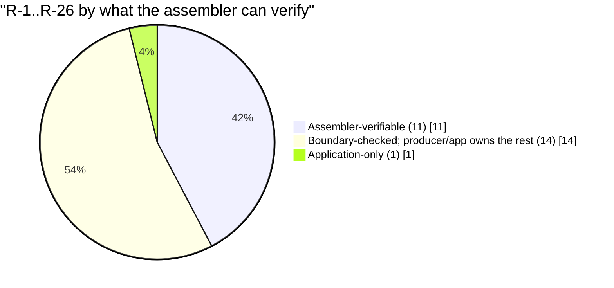

| Scope | Requirements | What the assembler can do |
|---|---|---|
| **Assembler** | R-1, 2, 3, 6, 7, 17, 21, 22, 24, 25, 26 | Fully implement and test. |
| **Boundary** | R-4, 8, 9, 10, 11, 12, 13, 14, 15, 16, 18, 19, 20, 23 | Check the handoff: producer kind, `relevance` present, expiry, allow-list membership, profile evaluation gate, the injection marker, the required slots, evidence after fitting, the rendered count, placement and pinned profiles, and replay from the frozen snapshot. It cannot see whether a producer merged a blob (R-13), whether a variant introduced a new fact (R-18), whether the app missed a conflict (R-11), whether a producer marked user or fetched content (R-10), whether every route a parser reads declares `parser: true` (R-4), whether retrieval and model calls happened before the snapshot froze (R-12, R-23), whether `budget.input` matches the model's context limit (R-16), or whether a profile change raised its version (R-20). Website `4f32396` moved R-4, R-10, R-12, R-16, R-20 and R-23 here. |
| **Application** | R-5 | Document the obligation. Nothing to test. |

**Recommendation for `assembler.html`:** add a `scope` column and allow the statuses `planned · in progress · implemented · boundary-checked · application obligation`. Generate the matrix from a `conformance-report.json` that the assembler's test suite emits. Stop hardcoding `"planned"`.

---

## 2. High-level design

### 2.1 Context and the purity boundary

Everything impure happens *before* `freeze_snapshot()`. Everything after it is a pure function. A retry never mutates a snapshot; it builds a new one (R-12, R-23).

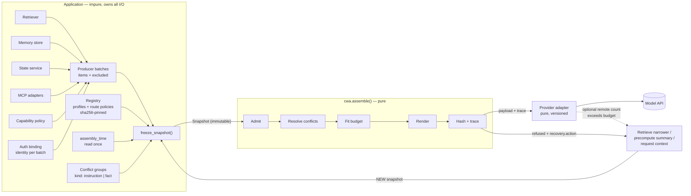

### 2.2 Revised API (replaces the `assembler.html` sketch, DA-4)

```python
from cwa import assemble, Snapshot, ProducerBatch, ProducerIdentity, CapabilityGrant, ConflictGroup, Scope, Budget
from cwa.registry import Registry
from cwa import renderers, tokenizers

reg = Registry.from_lockfile("cwa.lock.json")            # profiles + route policies, pinned by sha256

snapshot = Snapshot.freeze(
    batches=[                                             # identity is bound per BATCH by the app, never read from item.source
        ProducerBatch(producer=ProducerIdentity(id="policy-corpus", kind="retrieval"), items=..., excluded=...),
        ProducerBatch(producer=ProducerIdentity(id="memory-svc", kind="memory"),       items=..., excluded=...),
        ProducerBatch(producer=ProducerIdentity(id="cap-policy", kind="capability_policy"), items=..., excluded=...),
    ],
    capabilities=CapabilityGrant(policy_producer="cap-policy", allow_list_version="v3", allowed_ids=("cap:issue_refund",)),
    conflicts=[ConflictGroup(id="g1", kind="fact", fact="refund.window", items=("refunds-eu:v17#p4", "crm:order#42"))],
    scope=Scope(tenant="acme", user="u_91", session="s_7", task="refund_request"),
    assembly_time="2026-09-22T12:00:00Z",                 # explicit; the core never reads a clock
    route_policy=reg.policy("support-chat", "v1"),
    profile=reg.profile("policy-first-chat", 1),
    tokenizer=tokenizers.get("fixture-whitespace/v1"),
    renderer=renderers.get("cwa-text/v1"),
    budget=Budget(input=8192, reserved_output=1200),      # input is already net of reserved_output
)

result = assemble(snapshot)   # pure
result.refused                # bool
result.payload                # bytes | None
result.trace                  # dict, validates against trace.schema.json
snapshot.digest()             # sha256 of canonical snapshot JSON, the replay key
```

The snapshot stores the *outcome* of authentication (producer id, kind, verified flag), never credentials. Snapshots hold user content, so the app owns their retention policy. Traces carry IDs and never bodies.

### 2.3 Package layout

This is the planned layout. As built through M14, `src/cwa/` holds `assemble.py` (pipeline, refusals and the R-12 recovery mapping), `admission.py`, `conflicts.py`, `fitting.py`, `snapshot.py`, `model.py`, `canonical.py` (RFC 8785), `instants.py`, `trace.py`, `render/` (`fixture_xml.py`, `messages.py` from M4), `tokenize/` (`fixture_whitespace.py`, and `estimate_utf8.py` from M11), `py.typed` (M14) and `registry.py` (M4), `supersede.py` (M8), `dedupe.py` (M7), `diversity.py` (M9) and `contract/` (vendored data, pinned by `contract.lock.json`). M5 added `strings.py` (the portable string rules) and `conformance.py`, the runner behind `python -m cwa.conformance`. There is no `evidence.py`, `policy.py` or `reasons.py`: the reason registry and route policy are read from the vendored JSON.

```
cwa/
  __init__.py          assemble, Snapshot, ...
  model.py             frozen dataclasses: Item, Variant, ProducerBatch, ProducerIdentity, ConflictGroup, Scope, Budget
  snapshot.py          freeze(), canonical JSON, digest()
  admission.py         ordered checks → Admitted | Exclusion
  conflicts.py         instruction + fact resolution
  fitting.py           tiered shedding, variant selection
  supersede.py         route-requested supersession of stale observations (R-25, M8)
  dedupe.py            route-requested exact deduplication (R-24, M7)
  diversity.py         route-requested source diversity cap (R-26, M9)
  evidence.py          R-12 check + recovery mapping
  render/              Renderer protocol · fixture_xml.py · text.py · messages.py
  tokenize/            Tokenizer protocol · fixture_whitespace.py · estimate_utf8.py (a tiktoken adapter is an example, outside the core)
  policy.py            RoutePolicy (declarative), predicates
  registry.py          lockfile, sha256 pins for profiles and policies (R-20)
  trace.py             TraceBuilder, schema validation, canonical ordering
  reasons.py           reason-code registry (mirrors contract/reasons.json, DA-13)
  contract/            vendored schemas, slot-defaults.json, requirements.json + MANIFEST.sha256
conformance/
  cases/<name>/{snapshot.json, expected.trace.json, expected.payload}   language-neutral
  runner.py            emits conformance-report.json → drives the website matrix
tests/                 unit + property (hypothesis) + purity guards
```

---

## 3. Data model

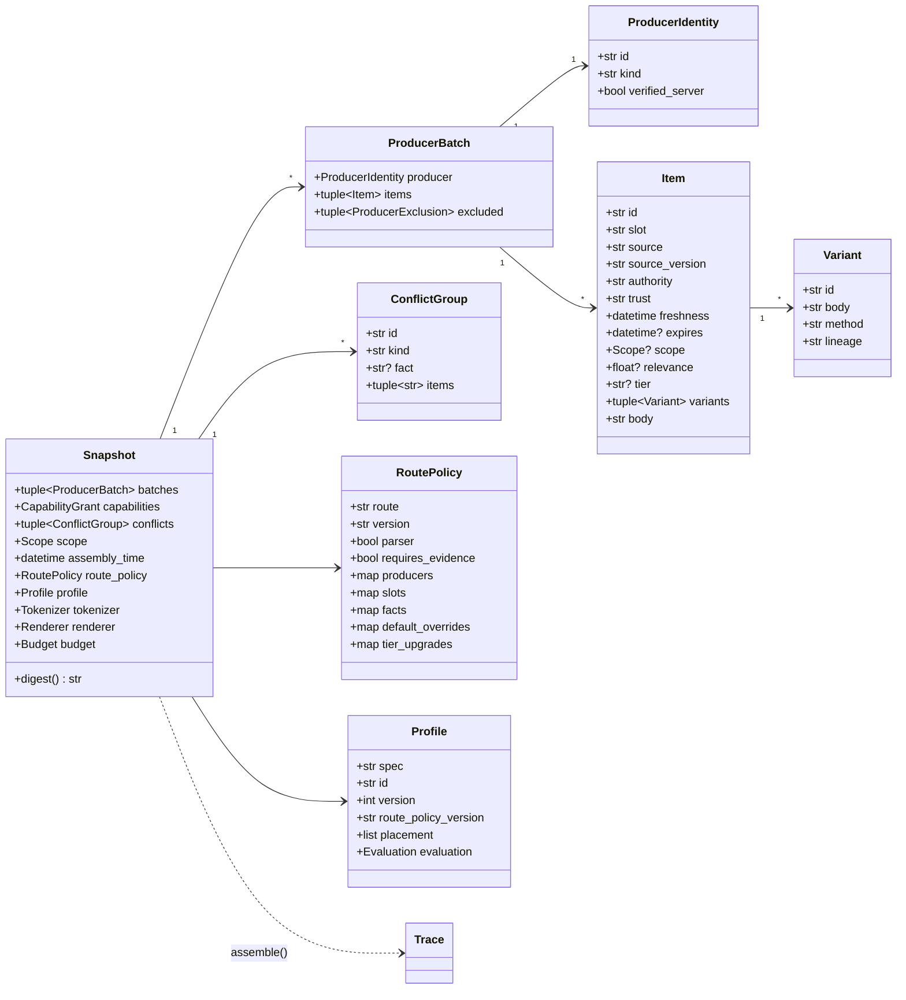

`ConflictGroup.id` and `ConflictGroup.fact` came from DA-9: a fact conflict cannot be looked up in route policy without a fact key. Both are in `conflict_group.schema.json` (D-6).

### 3.1 Route policy: declarative, hashed, no code strings

R-3 says the route owns the *executable* eligibility predicate. Keep it declarative so it can be hashed and replayed. The schema has only closed vocabularies (thresholds, ages, scope keys, source prefixes); named predicates are not supported. This example validates against `route_policy.schema.json`.

```jsonc
{
  "route": "support-chat", "version": "v1",
  "parser": true,                    // R-4: output_contract required
  "requires_evidence": true,         // R-12
  "clock_skew_seconds": 5,           // DA-16  (M1: in schema)
  "producers": {                     // who may emit what (R-8, R-15)
    "policy-corpus": {"kind": "retrieval", "slots": ["evidence.knowledge"]},
    "memory-svc":    {"kind": "memory",    "slots": ["interaction.memory"]},
    "crm-mcp":       {"kind": "mcp",       "slots": ["evidence.tool_results"], "verified": false},
    "cap-policy":    {"kind": "capability_policy", "slots": ["governance.capabilities"]}
  },
  "slots": {
    "evidence.knowledge": {"min_relevance": 0.82, "max_age_seconds": 7776000, "required_scope": ["tenant"],
                           "priority": 40, "order_by": ["-relevance", "-freshness"], "min_included": 1},
    "state.task":         {"max_age_seconds": 60, "required_scope": ["tenant", "task"]},
    "interaction.memory": {"source_prefix": "turn:"}
  },
  "fitting_order": [{"slot": "interaction.history", "action": "omit"}],  // R-16
  "default_overrides": {"evidence.knowledge": {"token_budget": 420}},   // R-3: versioned, traced
  "tier_upgrades": {"state.user": "protected"},                          // R-16: upgrade only, never downgrade
  "facts": {
    "refund.window": {"precedence": ["crm-mcp", "policy-corpus"], "scope": ["tenant"],
                      "freshness_tiebreak": false, "on_unresolved": "surface"}
  },
  "on_unresolved_instruction": "refuse"
}
```

---

## 4. Pipeline deep dive

This is the pipeline as first designed. What is built differs: see "Refusals as built" below and §4.1–§4.5. Step 0 became a `SnapshotError` with no trace, step 2 became route-requested supersession (M8), exact deduplication (M7) and the source diversity cap (M9), which run after step 3 (§4.2), step 3 runs before step 4, and step 5 became admission's `slot_unplaced` check plus the `protected_slot_unplaced` refusal (M4).

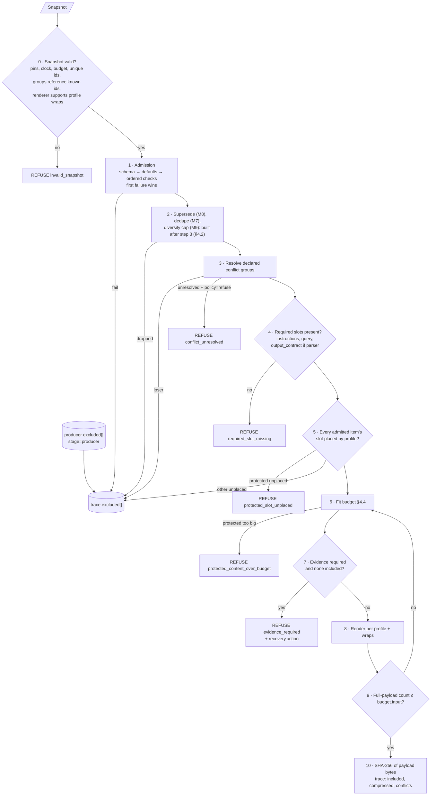

**Refusals as built (M2–M4).** An invalid snapshot is a `SnapshotError` before assembly and has no trace, so there is no `invalid_snapshot` code; that includes a profile that does not place the required slots (M4). Refusal precedence is the order of the refusal codes in `contract/reasons.json` (R-21): `required_slot_missing` > `protected_slot_unplaced` > `conflict_unresolved` > `protected_content_over_budget` > `evidence_required`. An unprotected item in a slot the profile does not place never reaches the refusal checks: admission excludes it with `slot_unplaced` (§4.1). Every refusal emits `result: null`, `included: []` and `compressed: []`. Conflicts resolve right after admission, before any refusal check, so every refused trace keeps `conflicts[]` and the producer, admission and conflict rows in `excluded[]`. An `evidence_required` refusal also keeps its `over_budget` rows (R-17).

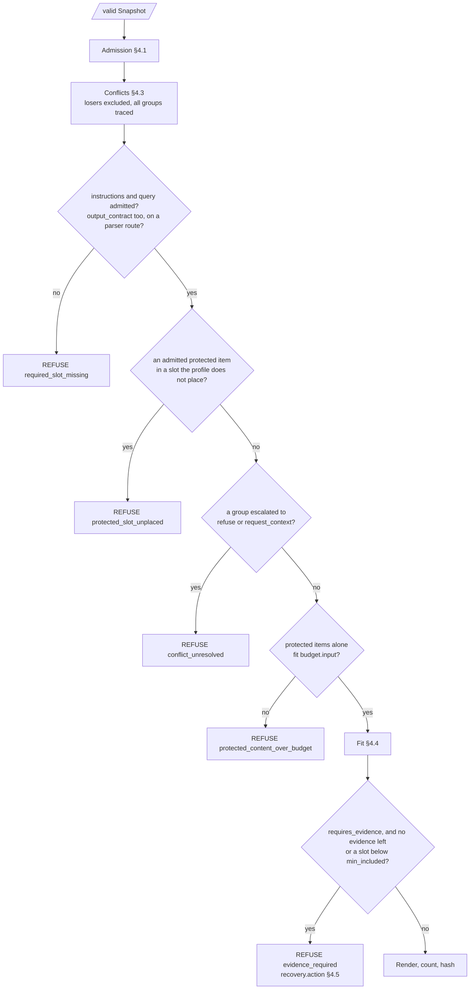

### 4.1 Admission: precedence as built (M1)

Each exclusion row carries exactly one `reason`, so check order is part of the contract. The order is the order of `contract/reasons.json` (R-21), and `src/cwa/admission.py` runs its checks in that order. The first failing check wins, and an item that passes every check is admitted.

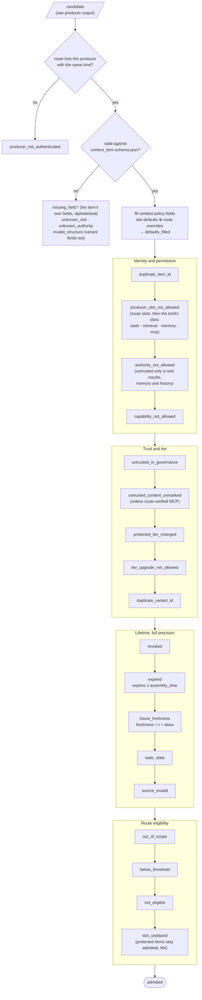

Each box is one check, named by the reason it records when it fails. Producer-stage exclusions reported in the batch go straight to the trace, ahead of assembler rows, `duplicate_of` and `superseded_by` included; the snapshot check that each names a candidate of its own batch runs before assembly (R-9, R-13). A candidate without a usable id is recorded as `{producer}#invalid-{n}`.

A producer's kind limits its slots whatever the route lists (website `5a40d11`, 2026-09-27): state slots take only kind `state` (R-8), a `memory` producer sends only `interaction.memory` (R-14), and a `retrieval` or `mcp` producer only `evidence.knowledge` and `evidence.tool_results` (R-13, R-15). The one exception is a tool specification an `mcp` producer sends to `governance.capabilities`, which falls to the capability check and is excluded with `capability_not_allowed`. `untrusted` authority is allowed only in `evidence.tool_results`, `interaction.memory` and `interaction.history` (R-1): never in governance, knowledge, state or the query.

The website settled six admission edge cases on 2026-09-23 (the spec page changelog, "admission edge cases"), and this assembler follows each. `missing_field:<name>` names the item's own fields, so a variant missing one of its fields is `invalid_structure`, and an item with no slot is `missing_field:slot`, because the schema's memory and knowledge conditionals now require `slot`. A state item from a producer whose kind is not `state` is `producer_slot_not_allowed` even when the route lists the slot for it (R-8). `duplicate_item_id` counts every other candidate's usable id, whatever its outcome, and every producer exclusion's `item_id`, in any batch; each copy takes the earliest code that applies to it. `protected_tier_changed` guards only slots protected by default, so an item may lower its own tier in a slot the route raised. Producer rows reach the trace from every batch, an unauthenticated producer's included.

Snapshot normalization sorts batches by producer id and items by id, so the order producers return in cannot change the payload or the digest (DA-15). Candidates that share an id, and producer exclusions that share an item id, sort by their RFC 8785 serialization, so duplicates cannot make the digest order-dependent either. Items without a usable id keep their supplied order after the rest, which keeps their recorded ids stable on replay.

### 4.2 Supersede (M8), dedupe (M7) and source diversity (M9), as built

**Exact dedupe (M7, D-13).** R-24 specifies it, and `src/cwa/dedupe.py` follows `conformance/README.md`'s Deduplication section. It runs right after conflict resolution and before any refusal check, so every trace records its rows, and only in the slots whose route rules set `dedupe: "exact"`:

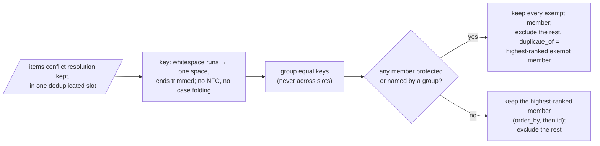

Each excluded copy is a `duplicate_content` row with its slot and `duplicate_of`, after the conflict rows and before the fitting rows, in item id order. Near-duplicates stay with the retriever (D-17): one that drops a passage reports it in its batch's `excluded` list as `duplicate_content` with `duplicate_of` naming the candidate it kept (R-13, website `09ea2f4`). The snapshot is rejected when that id is not a candidate in the same batch, and the trace carries the row as reported, ahead of the assembler's rows. Whitespace is `cwa.strings.WHITESPACE`, the ECMAScript set, not Python's `\s`. A duplicate is not omitted for budget, so it leaves R-12's recovery at `request_context`. `dedupe_ms` times the stage when a clock is lent.

**Supersede (M8, D-14).** R-25 specifies it, and `src/cwa/supersede.py` follows `conformance/README.md`'s Supersession section. It runs right after conflict resolution and before dedupe, only in the slots whose route rules set `supersede: "source"`:

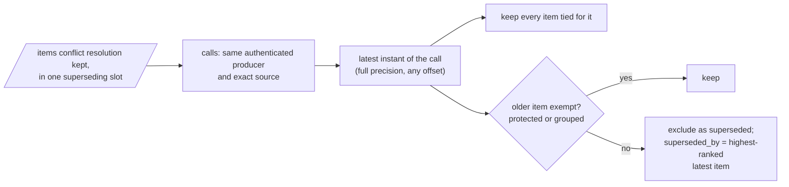

Rows follow the conflict rows and precede the dedupe rows, in item id order. The producer comes from `Admission.producers`, the identity the application authenticated, never from the item. `supersede_ms` times the stage when a clock is lent.

**Source diversity (M9, D-15).** R-26 specifies it, and `src/cwa/diversity.py` follows `conformance/README.md`'s Source diversity section. It runs right after dedupe, so a copy never takes a place, and before any refusal check, only in the slots whose route rules set `max_per_source`:

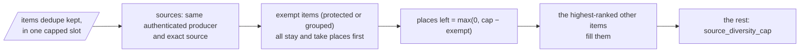

Rows follow the dedupe rows and precede the fitting rows, in item id order, and name nothing kept. `diversity_ms` times the stage when a clock is lent.

The original design notes follow; D-13 to D-15 changed them: stages run after conflicts, dedupe dropped NFC, and every stage is keyed or exempted as above. 

- **Deduplicate.** v0 uses an exact hash of NFC-normalized, whitespace-collapsed body → `duplicate_content`, keeping the item that sorts first by `order_by`. "Near-identical" needs a similarity metric. It stays deterministic only with fixed seeds (MinHash) or precomputed cluster ids from producers, and there is no schema field for those yet.
- **Supersede.** `evidence.tool_results` with `supersede_by: source` keeps the newest `freshness` per source → `superseded`. This implements "fresh observations replace stale ones for the same call", which has no call-identity field (DA-19).
- **Diversity.** `max_per_source` → `source_diversity_cap`.

### 4.3 Conflict resolution (as built, M3)

The assembler never reads prose. It acts only on the groups the application declares (R-11), and `src/cwa/conflicts.py` follows `conformance/README.md`'s Conflicts section. Resolution runs right after admission, before any refusal check, so every trace records `conflicts[]`. A group's members are the items it names that admission admitted.

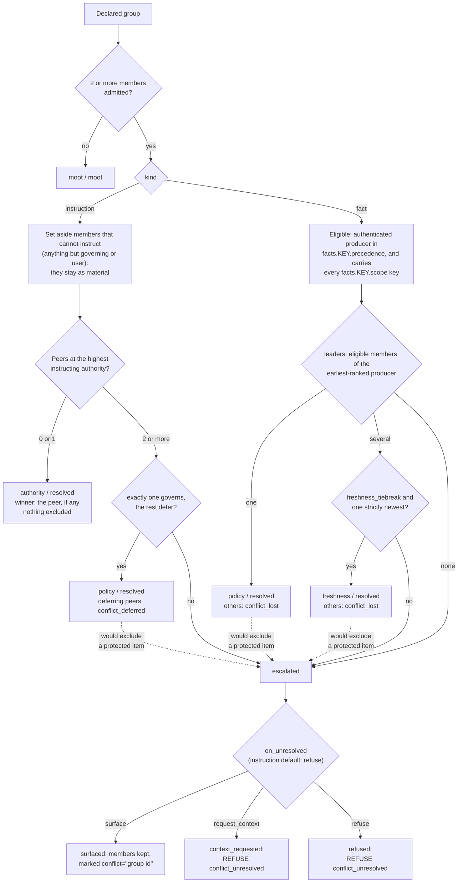

- **Authority never decides a fact group** (R-6), and `conflict_policy` is read only between instruction peers (R-3). A `governing` example that loses a fact group is excluded like any other member.
- **Precedence reads the authenticated producer**, which admission records per item, and never `item.source` (R-15).
- **Protected items are never excluded by a conflict**, so the protected user request, which `defers` by default, cannot lose to a history turn that `governs`. The required-slot check therefore stays sound after resolution.
- **Refusal.** `conflict_unresolved` comes right after `required_slot_missing`. `recovery.action: request_context` is set only when every refusing group asked for context. A refused trace keeps `conflicts[]` and the conflict rows.
- **Trace order.** `conflicts[]` is ordered by group id, and each record's `items` by item id. Conflict rows come after the admission rows, ordered by item id, and before the fitting rows.
- **Surface marks** reach the renderer through `place()`. Fitting renders the same marks, so they count against the budget like any wrapper.

### 4.4 Fitting (as built, M2)

The unit of accounting is the **occurrence**, not the item. A slot placed twice (`long-context-reinforced`, `extraction`) costs twice and appears twice in `included[]` (R-16). Fitting decisions are made per item, so both occurrences shed or compress together, and each included occurrence of a compressed item gets its own `compressed[]` row. `src/cwa/fitting.py` follows `conformance/README.md`'s Fitting section:

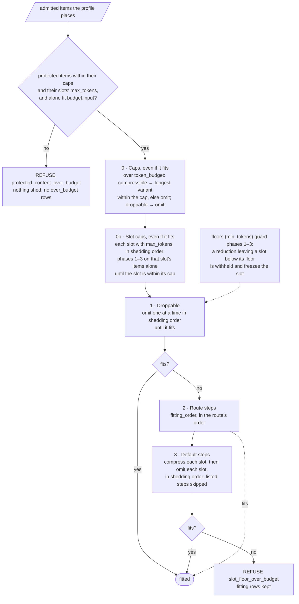

Every "fits?" renders and counts the **whole** payload with the snapshot's tokenizer, and every step stops as soon as the payload fits. A step visits one slot's compressible items, lowest rank first:

- **compress** selects a supplied variant whose rendered body is shorter than the item's current body (its own, or the variant its cap chose): the longest that makes the payload fit, else the shortest, with the earlier variant winning ties (R-18). An item without a shorter variant is skipped.
- **omit** removes the item, compressed or not, and traces it `over_budget` with its slot.

Protected items appear in no step. An item's tier is its own `tier`, else its slot's default raised by `tier_upgrades`, so an item that volunteers `droppable` sheds in phase 1.

**Slot floors (M10, D-16).** A route's `slots.<slot>.min_tokens` guards phases 1–3 only, not item caps or slot caps. `_shed` takes the floors for the budget-pressure call alone: before an omission or compression in a floored slot it measures the slot as the reduction would leave it (`slot_tokens`, every occurrence), and if that is below the floor the reduction is withheld and the slot frozen, so nothing later in phases 1–3 touches it. A frozen slot can keep droppable items while other slots compress, the one exception to R-16's tier order. Before floors, the payload always fit once phases 1–3 ran, so `fit()` asserted it; now a payload that still does not fit refuses with `slot_floor_over_budget`, and `assemble()` keeps the fitting rows, as it does for `evidence_required`.

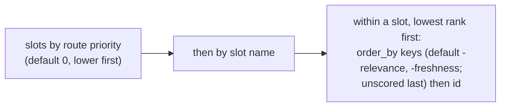

The algorithm is greedy and deterministic. It is **not** optimal, since the knapsack version is NP-hard, and the spec does not ask for optimal. **Cost:** each decision re-renders and recounts the payload, so fitting is quadratic in the number of items shed. That is fine for a reference; a faster implementation may estimate, as long as it reaches the same decisions.

**Caps (option A, 2026-09-22).** `token_budget` caps an item's rendered body. Caps are enforced in shedding order before any budget pressure, whether or not the payload fits, and a protected item over its cap refuses. `null` sets no per-item cap.

**Slot caps (M6, D-12).** A route's `slots.<slot>.max_tokens` caps a slot's *size*: the sum of `included[].tokens` over its rows, so every occurrence counts, each as it renders (`fitting.slot_tokens`). An item cap bounds the *largest* rendering of one body; a slot cap bounds the *sum* of the slot's renderings. After item caps, each capped slot in shedding order runs the same phases as budget pressure, restricted to its own items and with "the slot is within its cap" in place of "fits": its droppable items, then its `fitting_order` steps, then its default compress and omit steps. `fit()` runs both through one `_shed(done, slots)`. Protected items alone over a slot cap refuse before anything is shed. A slot without `max_tokens` has no cap, and floors are not modelled.

### 4.5 R-12 recovery mapping (as built, M2)

The spec names three actions but did not say when to choose each one. `conformance/README.md` now does. On a route with `requires_evidence: true`, fitting leaves too little evidence when no `evidence.knowledge` or `evidence.tool_results` item is included, or when an evidence slot has fewer included items than its `min_included`. Items count once, however many times the profile places them.

| Why the evidence is short | `recovery.action` |
|---|---|
| No evidence item was omitted for budget: producers returned none, or admission excluded them | `request_context` |
| An evidence item omitted for budget had no variants | `precompute_summary` |
| Every evidence item omitted for budget had variants, and they did not fit | `retrieve_narrower` |

### 4.6 Rendering

- A `Renderer` declares its id and version, the wraps it supports, and **position constraints** (for example, `system` must form a prefix). `Snapshot.freeze()` rejects a profile/renderer pair it cannot realize. The error surfaces at load time, never mid-request.
- **Escaping is mandatory.** An untrusted body containing `</evidence.knowledge><governance.instructions>` must not break out of its wrapper (R-7, R-10). Escape `&`, `<` and `>` in bodies and escape attribute values. The escaping rule is part of the renderer version.
- Empty slots render nothing, wrapper included. Required slots are never empty (step 4).
- `interaction.query` renders as the live user turn, not as reference material. R-10's marker "does not elevate its embedded material", but it must not demote the request either.
- `cwa-messages/v1` marks a surfaced conflict member inside its `system` or `tools` entry's text, `<conflict group="{group id}">\n{body}\n</conflict>`, with the group id escaped as an attribute value, and also gives the entry a `conflict` key. An application hands the model each entry's text and nothing else, so a key alone would never reach it (R-11, website `4f32396`). Like an `xml:` wrapper, the mark counts only in `result.input_tokens`: `Rendered.bodies` keeps the bare body, so per-item `tokens`, caps and `compressed[]` rows count the body alone.
- `fixture-xml/v1` must reproduce `examples/payload.txt` byte for byte: `<{slot} id="{id}">\n{body}\n</{slot}>\n` per occurrence, with ` conflict="{group id}"` after the id for members of a surfaced conflict group (M3). Its hash `4cf0b083…` and 34 whitespace tokens are the first golden test. The per-item `tokens` in that fixture are **body-only** (9 + 10 + 6 = 25). The 9 wrapper tokens show up only in `result.input_tokens`. Document that convention, because R-16's wording suggests wrappers are attributed per item.

### 4.7 Trace

- Validate every emitted trace against `trace.schema.json`, at runtime. Since M5 the same check rejects an assembler row or a refusal whose reason is not a registered code of the right kind (R-21). Producer rows keep whatever the producer reported.
- Order traces canonically: `excluded[]` puts producer rows first (by producer id, then item id) and assembler rows after, in pipeline order. `conflicts[]` sort by group id. The trace is not hashed, but golden tests need stable ordering.
- Assembler rows in `excluded[]` carry `slot` whenever the candidate names one of the eleven slots, even when it fails for another reason (R-22). Producer rows report no slot.
- `trace_id` defaults to `uuid4`. Timings are measured, and excluded from all comparisons (R-23). `recovery.detail` is free text for people that no requirement defines, so `cwa.conformance.comparable` leaves it out too and compares the rest of `recovery`, `action` included (conformance/README.md, Running a case, step 4).

---

## 5. Devil's-advocate findings

Severity: **B** blocks implementation · **H** high (security or correctness) · **M** medium · **L** low.

| ID | Sev | The spec or site says | The problem | Recommendation |
|---|---|---|---|---|
| DA-1 | B | R-21: hash of "the exact rendered UTF-8 payload". Profiles use `wrap: system`, `wrap: tools`. | Chat APIs take a system parameter, a tools array and messages, not one string. `document-analysis` puts evidence *before* `system`. `long-context-reinforced` repeats instructions as a second `system`, which a single-system-param API merges back to the top and defeats the profile's intent. | Renderer output is **canonical bytes of a render IR**: `{system:[…], tools:[…], messages:[…]}` serialized as JSON with sorted keys, no floats, UTF-8 (RFC 8785-equivalent). The provider adapter is a pure, versioned function of that IR. Renderers declare position constraints, and unrealizable profiles are rejected at load. Change the repeated instruction wrap to `xml:instructions`. **D-1** **Done** (D-1, M4): `cwa-messages/v1` rejects unrealizable profiles, and both example profiles are now version 3 with `xml:instructions` repeats. |
| DA-2 | B | R-16: count with the declared tokenizer. R-23: no external reads. | Some providers expose counting only as a remote endpoint. BPE counts are not additive across segment boundaries. | `Tokenizer` protocol with `exact: bool` and `margin`. Estimators must declare a margin, which is recorded in `context.tokenizer`, e.g. `estimate-cl/v1+8%`. Optional remote verification runs *after* assembly, outside the pure core, and an overflow produces a new snapshot with a smaller budget. **D-3** **Decided** (D-3); only the exact fixture tokenizer is built. |
| DA-3 | B | R-16: "drop droppable before compressing compressible". Spec §4.1: compressible "may be replaced by a variant". | Nothing says what happens when the smallest variants still don't fit. The landing demo refuses. The "Budget" stage says "admit only content that fits", which implies dropping. A strict reading refuses whenever retrieval is generous. | Add Phase 3, dropping compressible items by route priority, and amend R-16 to say so explicitly. **D-2** **Done** (D-2, M2). |
| DA-4 | B | `assembler.html` API: `assemble(items, profile, budget, route_policy)` | Clock, scope, conflicts, producer identity, tokenizer and renderer are absent, so they would have to be ambient, which violates R-23. | `assemble(snapshot)` (§2.2). **Done 2026-09-22** on `assembler.html`. |
| DA-5 | H | `assembly-sketch.txt`: `items=flatten_items(batches)`, `producer_context=…` separately | After flattening, which producer emitted which item is lost. That makes R-15's "bind producer identity outside item-controlled fields" impossible. | Keep batches intact in the snapshot, with identity per batch. **Done 2026-09-22** in `assembly-sketch.txt`. |
| DA-6 | H | R-10, R-7 | No wrapper escaping rule. Untrusted text can close the evidence tag and open a governance tag. | Mandatory escaping, versioned with the renderer. Add injection fixtures to conformance. **Done** in M0 (bodies and attributes escaped; conflict marks too, M3). The injection conformance case is `messages-render` (M4). |
| DA-7 | H | R-11: instruction conflicts resolve "governing over user, then conflict_policy". | Resolution has no defined *payload effect*. The user query is protected and can't be excluded. It is unstated whether a deferring example is dropped. | Governing vs user: record only. Peers: exclude `defers` members unless protected. Otherwise escalate (§4.3). **Done** (M3). |
| DA-8 | H | R-15 and contract.js check the capability grant | The per-user allow-list is dynamic, so it can't live in static route policy. | `CapabilityGrant` in the snapshot, produced by the authenticated capability policy. **Done** (M1). |
| DA-9 | M | R-11: route policy specifies "fact identity, scope". Groups are `{kind, items}`. | There is no key to look up the fact's precedence rule. | Add `id` and `fact` to conflict-group input. Precedence matches **authenticated producer id**. **Done** (D-6; resolved in M3). |
| DA-10 | M | Trace `conflicts[].decided_by` ∈ {tier, policy, freshness, escalated} | (a) `tier` collides with the budget `tier` field. (b) `policy` is ambiguous between route fact policy and item `conflict_policy`. (c) There is no value for a group that became moot because a member was excluded at admission. | Rename to `authority` in the next schema revision. Add `moot`. Until then, document the meanings. **Done** (D-6). |
| DA-11 | H | Item `scope` is optional, and all keys are optional | Is a missing key a wildcard? If so, an item with no `tenant` is admissible to every tenant. | Route declares `required_scope` per slot. A missing required key → `out_of_scope`. **Done** (M1). |
| DA-12 | M | R-16: items MUST NOT downgrade protected | Upgrades are unrestricted. A buggy or hostile producer marks everything `protected` and forces refusals or displacement. | Only the route's `tier_upgrades` may upgrade. An item-level upgrade → `tier_upgrade_not_allowed`. This also answers "state.user (entitlements) is droppable": upgrade it per route. **Done 2026-09-22** (R-16, `contract.js` `context.tierUpgrades`). |
| DA-13 | M | `producers.html` lists `missing_field:<name>`, `unknown_slot`, `unknown_authority` | `contract.js` emits `invalid_structure` for all of these, plus eight codes the page never lists (`revoked`, `future_freshness`, `untrusted_content_unmarked`, …). | Add a canonical `contract/reasons.json` that generates the page, contract.js and `cwa/reasons.py`. **Done:** `contract/reasons.json`, read directly (no `reasons.py`). |
| DA-14 | M | R-22 `defaults_filled: string[]`, "identify each affected item and field" | Item ids legitimately contain `#` and `:` (`refunds-eu:v17#p4`), so any `id.field` string is ambiguous. | Change the schema to `[{item_id, field}]`, or define RFC 6901-escaped `item_id/field`. **Done** (D-6). |
| DA-15 | M | R-23 lists "identical items" | It says nothing about *order*. Parallel producers return in nondeterministic order. | Canonical sort on entry. Property test: shuffling input doesn't change the hash. **Done** (M0); every conformance case is shuffle-tested, and duplicate ids no longer move the digest. |
| DA-16 | M | contract.js: `freshness > assembly_time` → excluded | Producer clock skew of milliseconds causes spurious exclusions. | Route `clock_skew_seconds` tolerance, recorded via the policy version. **Done** (M1). |
| DA-17 | M | Website validates `format: date-time` via ajv-formats | Python `jsonschema` ignores `format` unless a `FormatChecker` is passed *and* `rfc3339-validator` is installed. `freshness: "yesterday"` would pass silently. | Pin both and add bad-timestamp conformance cases. **Done** (M0; `kb:bad-date` in `admission-reasons`). |
| DA-18 | M | Expiry compares `expires ≤ assembly_time` | JS `Date.parse` truncates to milliseconds, and Python keeps microseconds. `expires = 12:00:00.0005Z` is expired in JS and live in Python. | Spec: compare at full given precision, or define millisecond truncation. Add a conformance case either way. **Done:** full precision (M1; `kb:sub-ms` in `admission-reasons`). |
| DA-19 | L | "Fresh observations replace stale ones for the same call" | No call-identity field. | `supersede_by: source` route rule (§4.2). **Deferred** with §4.2. |
| DA-20 | M | Profile `route_policy_version` is a string. R-20 requires a version bump on change. | Nothing stops someone editing a profile or policy in place under the same version. | Lockfile pins sha256 per `(id, version)`, and a mismatch is a load error. **Done** (M4): `cwa.registry`, with the lock format in `schema/registry_lock.schema.json`. |
| DA-21 | M | `document-analysis` has no `governance.capabilities` or `evidence.tool_results` placement | If a protected capability is admitted on that route, the profile must not omit it (R-20). | Step 5: `protected_slot_unplaced` refusal. Unprotected → `slot_not_placed` exclusion. **Done** (M4) as `protected_slot_unplaced` and `slot_unplaced`. |
| DA-22 | M | R-1: history carries `user` authority | Prior *assistant* turns are not user authority. Rendering them as native assistant messages versus a transcript block changes both authority semantics and token counts. | Assistant turns use `authority: untrusted` (R-1 allows it) and render inside a transcript block. **Done 2026-09-22** (D-5). |
| DA-23 | L | Stages "Packetize … binding or informative", "Filter … jurisdiction", "Attribute … carry citation requirements into the output contract" | No schema fields exist for binding/informative or jurisdiction. Mutating the protected, verbatim output contract would break R-16. | Attribute = renderer emits `id` on each packet, and the route's output contract references ids. The other two are out of v0 scope. |
| DA-24 | L | Trace schema `additionalProperties: false` | There is no place for a snapshot digest, so a trace cannot point back to its replay input. | Add optional `context.snapshot_digest`. **Done** (D-6). |
| DA-25 | M | R-5, and parts of R-8/11/13/14/18/19 | These cannot be verified by an assembler (§1.4). | Matrix scope column. Don't count them toward "implemented". **Done 2026-09-22:** `contract/assembler-scope.json` drives the column; the headline counts 22 checkable requirements. |

---

## 6. Determinism and testing

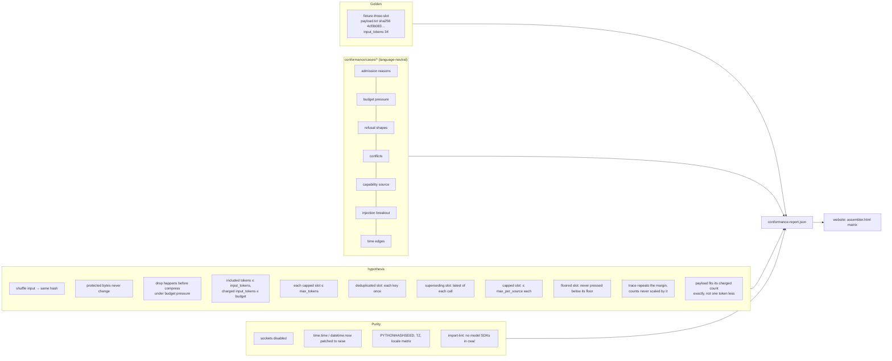

**Built so far (M0–M14):** the golden test, all fifty-eight conformance cases and twenty-four rejection cases (M12, `tests/test_rejections.py`), a shuffle test over every case (payload, trace and digest), purity guards on sockets, clocks, files, the environment and randomness (files since M5: the vendored schemas are read once, at import), and schema validation of every emitted trace. `tests/test_replay.py` (M5) stores every case's snapshot as JSON and replays it in fresh processes under three `PYTHONHASHSEED`, `TZ` and locale combinations, comparing payload, trace and digest. An import lint (M5) rejects any module in `src/cwa` that imports network, model-SDK, clock, randomness or process modules, or calls `now()`, `getenv()` and the like. `conformance-report.json` (M5) records each case's outcome for the website, and a test fails when it is stale. `tests/test_properties.py` (after M5) runs P1–P11 with hypothesis over generated snapshots, plus two more: a refusal has no payload and a payload carries its hash, and a stored snapshot replays to the same outcome. The generator varies item counts per tier, bodies and ids with escapable and astral characters, variants, budgets, slot priorities, `order_by`, `fitting_order`, both renderers, both built-in tokenizers, `budget.margin_percent` (absent, 0, 100 or between), on about half the routes `max_tokens` on any of five slots, one of them protected, and `dedupe`, `supersede` and `max_per_source` on any generated slot, with bodies sometimes drawn from a small pool of whitespace variants and near misses so that duplicates occur, and sources from a small pool so that calls repeat. P7 and P8 check supersession and the cap against oracles written from the README's rules. P9 reshapes each drawn route, dropping its caps and adding a floor if it has none, so it never filters inputs away, and the refusal property checks that `slot_floor_over_budget` appears only on routes with floors. It checks that admission accepts everything it builds. P3 holds only on routes without slot caps (M6) or floors (M10): a cap sheds its own slot's items, so another slot may keep its droppable items. A droppable item removed as superseded (M8), as a duplicate (M7) or by the cap (M9) counts as gone. A targeted mutation broke each property's guarantee in turn, and each was caught by its property alone. The generator also draws `estimate-utf8/v1` and a margin, both from M11. Each tokenizer has its own range for `budget.input`, since `estimate-utf8/v1` counts each rendered wrapper three to six times higher, and the range is scaled up by the margin. That keeps budget pressure, fitting and refusal all common under every tokenizer and margin. P2 counts with the snapshot's tokenizer. P4 compares the charged count, `(n*(100+m)+99)//100`, with `budget.input`, not the raw one. It is the only property that compares a count with the budget: caps and floors (P5, P9) compare unscaled counts. P10 checks that the trace's budget repeats `margin_percent` exactly when the snapshot sets it and omits it otherwise. It also checks that each `included[].tokens` equals the tokenizer's count of the chosen body, and that `result.input_tokens` equals the count of the payload's texts, so neither is scaled by the margin. Mutations were each caught: fitting without the margin (by P4), a trace budget that drops or always writes the margin, scaled `included[].tokens`, scaled `input_tokens` (by P10), and a snapshot tokenizer replaced with `fixture-whitespace/v1` (by P2 and P10). A charged count rounded down at first survived them, because a random budget rarely lands on the exact boundary; P4 catches it only sometimes. P11 sets the budget there. It assembles the drawn route with an unlimited budget to get its payload's n tokens, then sets `budget.input` to exactly the charged count and to one less, with a margin of 0, 100, or between 1 and 99 (usually a fractional charge). It checks that the exact budget keeps the payload whole and that one token less reduces it or refuses. Mutations were each caught by P11: rounding down (on every seed tried), rounding to nearest, rounding up one too far, and a strict fit test. M11 added `tests/test_tokenize.py` and `tests/test_examples.py`. M14 added `tests/test_packaging.py`, which runs mypy, and `tests/test_scale.py`, which pins linear tokenizer calls (§7).

- **The golden test comes first.** Reproduce `examples/trace.json` and `examples/payload.txt` exactly. The fixture already exists and is hash-checked, so it's a free end-to-end test.
- **Tests map to requirements.** Each conformance case declares `rules: ["R-16", "R-17"]`. A row flips to *implemented* only when every assembler-scoped clause has a passing case. That is the rule `assembler.html` already states.
- **Replay test.** Serialize the snapshot, reload it in a fresh process, and compare hashes.

---

## 7. Scale and performance

| Dimension | Expected | Design response |
|---|---|---|
| Items per request | 10–500 | O(n log n) sort-dominated. Admission is O(n). |
| Tokenizer calls | 1 per occurrence + 1 full count per fit iteration | Cache standalone counts by `(tokenizer id, sha256(body))` *inside* the call. The cache is pure memoization and is never shared across snapshots unless keyed by tokenizer version. |
| Fit iterations | Usually 1–2 | The final full count corrects estimate drift. |
| Memory | Proportional to the snapshot | No copies of bodies. Variants are selected by reference. |

The assembler is a library, not a service. Scaling is the application's concern. The one thing that grows badly is a **remote** tokenizer, which is why DA-2 keeps it out of the core.

**Measured (M14, 2026-09-23).** `scripts/bench.py` assembles fixture-three-slot with n retrieved passages. "fits" has an unlimited budget; "tight" has 60 tokens, so nearly every passage is omitted. Times are from one Apple Silicon laptop under Python 3.14.

| Items | Budget | Omitted | Tokenizer calls | Characters tokenized | Time (ms) |
|---:|---|---:|---:|---:|---:|
| 10 | fits | 0 | 26 | 6,250 | 1.8 |
| 10 | tight | 8 | 46 | 26,790 | 1.8 |
| 100 | fits | 0 | 206 | 54,040 | 10.2 |
| 100 | tight | 98 | 406 | 2,000,395 | 24.5 |
| 500 | fits | 0 | 1,006 | 268,440 | 50.3 |
| 500 | tight | 498 | 2,006 | 48,998,355 | 351.2 |

Tokenizer calls grow linearly, about 2 per occurrence plus 2 per reduction, and `tests/test_scale.py` pins that. The expectations above were wrong in two ways. No cache was built, and "Fit iterations: usually 1–2" holds only when little sheds: each reduction is its own fit test, and each fit test renders and counts the whole payload. So the **characters tokenized grow quadratically** under heavy shedding, about 49 million for 500 passages, and time follows once shedding dominates. At the 500-item ceiling this is a third of a second; at a few thousand it would be seconds. Any faster fit must reach byte-identical decisions in every language, so it is a spec question, not a local optimization. The options are summing per-occurrence counts, which is exact only for tokenizers that are additive across the renderer's separators, or binary search over a step's reductions, which assumes the payload count only falls as items go. Neither is built. **Decided (D-21): leave the fit test as it is for v1.** The conformance README's Fitting section states the cost and that no shortcut may change a decision, and the Producers page tells retrievers to send no more passages than the budget can use.

---

## 8. Build plan

```mermaid
flowchart LR
  M0["M0 · Skeleton<br/>vendored contract + manifest<br/>fixture renderer/tokenizer<br/>golden hash reproduced"] --> M1["M1 · Admission<br/>R-1 R-2 R-3 R-9 R-10<br/>R-13b R-14b R-15b R-8b"]
  M1 --> M2["M2 · Fit + refuse<br/>R-4 R-16 R-17 R-18b R-12"]
  M2 --> M3["M3 · Conflicts<br/>R-6 R-11b R-3"]
  M3 --> M4["M4 · Registry, profiles,<br/>message renderer<br/>R-19b R-20 R-7"]
  M4 --> M5["M5 · Hardening<br/>R-21 R-22 R-23<br/>conformance-report → website"]
  M5 --> M6["M6 · Per-slot budgets<br/>route max_tokens<br/>R-3 R-16 R-17"]
  M6 --> M7["M7 · Exact dedupe<br/>route dedupe: exact<br/>R-24"]
  M7 --> M8["M8 · Supersede<br/>route supersede: source<br/>R-25"]
  M8 --> M9["M9 · Source diversity<br/>route max_per_source<br/>R-26"]
  M9 --> M10["M10 · Slot floors<br/>route min_tokens<br/>R-16 R-17"]
  M10 --> M11["M11 · Pluggable tokenizer<br/>exact or estimator (D-3)"]
  M11 --> M12["M12 · Invalid-snapshot rejection<br/>no payload, no trace (R-17)"]
  M12 --> M13["M13 · Second implementation<br/>passes every case"]
  M13 --> M14["M14 · Release hygiene<br/>license, CI, changelog,<br/>py.typed, benchmark"]
  M14 --> V1(["Release: spec v1 (cwa/1)<br/>+ assembler 1.0.0"])
```

`b` = boundary-checked scope. R-5 is documented as an application obligation. With M5 the assembler reaches the honest ceiling: **14 implemented + 8 boundary-checked + 1 application obligation**, not "23 of 23". R-24 (M7), R-25 (M8) and R-26 (M9) are assembler-scoped, so the ceiling became 17 implemented + 8 boundary-checked + 1 application obligation. Website `4f32396` scopes R-4, R-10, R-12, R-16, R-20 and R-23 as boundary, since each also binds the application, so the ceiling is now **11 implemented + 14 boundary-checked + 1 application obligation**.

**Release plan (D-18, 2026-09-23): not started.** Nothing is public yet except the website, whose live pages still show the earlier draft. The spec stays plain "draft" until the spec, this assembler and the other reference tools go public together as v1: the schemas' `spec` const becomes `cwa/1`, the assembler becomes 1.0.0, and the website's branch merges to `main`. The maintainer made all four gates below conditions of that release:

- **M11 · Pluggable tokenizer.** Callers register tokenizers through a public API, exact or an estimator with a declared margin (D-3), and at least one real tokenizer ships or is documented as an example. Today only `fixture-whitespace/v1` exists, so no real route can be assembled.
- **M12 · Invalid-snapshot refusal.** Settle M0's shortcut, spec first: either an invalid snapshot yields a refusal trace under a new reason code, or the spec says that rejection before assembly, with no trace, is correct.
- **M13 · Second implementation.** A minimal JavaScript assembler passes every conformance case, which shows the suite is language-neutral (§10).
- **M14 · Release hygiene.** A LICENSE in both repos (the maintainer chooses which), CI running both suites, a CHANGELOG, `py.typed`, and a benchmark for §7's expectations.

**Contract update (2026-09-23): website `387a3e9`.** The website settled the admission edge cases in §4.1 (`f6becbe`, `7be2f49`, `a2dea4f`) and added two cases (`387a3e9`): `render-attribute-escaping` and `budget-margin-rounding`. Re-vendored, 45 of 46 cases passed at once, both new ones included, and every rejection case was still rejected. `admission-reasons` failed on one row: a variant missing `method` was recorded as `missing_field:method`, since every `required` error became `missing_field`. Now only the item's own required fields do, and a variant's are `invalid_structure`; a mutation that dropped the check was caught by `tests/test_admission.py` and the case. The other settled rules already held. Unit tests in `tests/test_admission.py` now pin each of them, and a mutation of each was caught: a missing slot, a lowered tier in a slot the route raised, producer rows from an unauthenticated batch, and the RFC 8785 order of candidates sharing an id and of producer rows sharing an `item_id`. The last had no case row, so only its unit test caught a mutation that dropped the tie-break.

Result: 46 of 46 cases pass and 14 of 14 rejection cases are rejected, and every checkable requirement is still claimed.

**Contract update (2026-09-27): website `fbb9a0c`.** The website revised the draft between `387a3e9` and `fbb9a0c`. R-13 gates retrieval producers to the evidence slots with the slot's authority, and R-14 and R-15 gate memory and MCP producers the same way, whatever the route lists (§4.1). R-1 allows `untrusted` only in tool results, memory and history. R-9 lets a producer exclusion name `superseded_by`, which, like `duplicate_of`, must be a candidate of the same batch, and limits producer reasons to the registry's exclusion codes, which the batch schema now checks. R-17 rejects a snapshot holding a number outside the double range. R-3 closes the eligibility predicate at the four slot-level rules, and R-12 counts an item omitted for its own cap as omitted for budget. `admission-reasons` gained a row for each new rule; four cases (`budget-protected-variants`, `conflict-surfaced-shed`, `evidence-cap-omitted`, `required-instructions-missing`) and eight rejection cases are new; and `conformance/check.py` checks the contract's own consistency. Re-vendored, 49 of 50 cases passed and 20 of 22 rejection cases were rejected: `admission-reasons` produced the wrong payload, `number-out-of-range` crashed on the canonical serializer's `ValueError`, and `superseded-by-unknown` on a field `ProducerExclusion` lacked, while the new batch schema rejected `producer-reason-unknown` by itself. A wrong payload is not a gap `PENDING` can hold and rejection cases have none, so this vendor commit carries the fixes (AGENTS.md): the kind gates and the R-1 slot set in `admission.py`, `superseded_by` on producer exclusions with its batch check and its trace row, and non-finite numbers in the I-JSON check. Unit tests pin each rule, and a mutation of each was caught: the kind gate dropped, `untrusted` allowed in the query and state, `superseded_by` unchecked, non-finite numbers accepted, and `superseded_by` dropped from producer rows. The ordering test's producer rows now use a registered reason, since the batch schema rejects any other. A follow-up commit brings `canonical.py` in line with the README's Snapshot digest section, which now states that RFC 8785 numbers are doubles: an integer beyond 2^53 rounds as JavaScript rounds it, and one beyond the double range is rejected with the other I-JSON problems (R-17), as the website's digest generator does.

Result: 50 of 50 cases pass and 22 of 22 rejection cases are rejected, and every checkable requirement is still claimed.

**Contract update (2026-09-27): website `c3562e9`.** An alignment review of this assembler against the spec at `84807a5` found every clause implemented and two behaviours the spec left open, on which this assembler and the TypeScript one disagreed while both passed every case. The first: `_capability` in `admission.py` required the grant's `policy_producer` to be listed with kind `capability_policy`, the TypeScript port checked the id alone, and R-15 never said what makes a producer the route capability policy. The maintainer kept this assembler's rule and wrote it into the spec (D-22): R-15 now authorizes a `governance.capabilities` item only when the snapshot carries a grant, the item's batch comes from the grant's producer, the route lists that producer with kind `capability_policy` and the allow-list names the item; anything else is `capability_not_allowed`. The README's admission rules, the reason text, the snapshot schema's `policy_producer` description and the website's `contract.js` say the same, and `capability-policy-kind` pins it: a grant naming a producer the route lists with kind `policy`, whose tool the allow-list names, is excluded. Re-vendored, all 51 cases passed and 22 of 22 rejection cases were rejected without a code change, and a unit test in `tests/test_admission.py` pins the kind rule beside the case; a mutation that dropped the kind check was caught.

Result: 51 of 51 cases pass and 22 of 22 rejection cases are rejected, and every checkable requirement is still claimed.

**Contract update (2026-09-27): website `591f7eb`.** The second behaviour the alignment review found: Python keeps JSON integers exact and JavaScript reads them as doubles, so against `min_relevance: 9007199254740993` this assembler excluded a score of `9007199254740992` as `below_threshold` while the TypeScript port admitted it, from a snapshot with one digest. The spec rejected only numbers outside the double range (R-17) and rounded integers beyond 2^53 as doubles for the digest alone. R-2 now says every number in a snapshot is an IEEE 754 double, read as the nearest double before any comparison (D-23), and the README's new Numbers section says where that applies and that a language which keeps integers exact must round them at the boundary. `threshold-beyond-2-53` pins it: a score equal to the rounded threshold passes, one below it is `below_threshold`, and two scores that round to the same double tie on rank, so budget pressure omits the one with the later id. Re-vendored, the case failed with a wrong payload, which `PENDING` cannot hold, so the vendor and the fix share one commit (AGENTS.md): `Snapshot.from_json` now rounds every integer beyond 2^53 to its double right after the I-JSON check, so admission, ranking, fitting and the digest all see what JavaScript sees. A unit test in `tests/test_admission.py` pins the threshold, and a mutation that dropped the rounding was caught.

Result: 52 of 52 cases pass and 22 of 22 rejection cases are rejected, and every checkable requirement is still claimed.

**Contract update (2026-09-30): website `4f32396`.** The website's `draft-release` branch revised the draft between `591f7eb` and `4f32396`. Six requirements are now scoped `boundary`, because each also binds the application: R-4 (declaring `parser: true` on every route a parser reads), R-10 (marking user-controlled and fetched content), R-12 (retrieving and summarizing before the snapshot freezes), R-16 (setting `budget.input` from the model's context limit), R-20 (raising a profile's version for every change) and R-23 (every external read and model call before the freeze). `status.json` claims them `boundary-checked` on the same tests, which cover every clause an assembler can see, and the ceiling in §8 becomes 11 implemented and 14 boundary-checked. The draft now also states rules this assembler already followed, each with a new case: a batch entry that is not a JSON object rejects the snapshot (R-2, R-17, `batch-entry-not-object`), an integer literal of any length that rounds past the double range is not I-JSON (`integer-out-of-range`), a producer's item in a slot the route does not list for it is `producer_slot_not_allowed`, an MCP tool included (R-15, `admission-route-slots`), `min_included` counts items, so an item the profile places twice counts once (R-12, `evidence-min-included-items`), and a `tier_upgrades` value at or below the slot default changes nothing (R-16, `budget-tier-lowering-ignored`). `conflict-instruction-request-context`, `budget-repeated-compress` and `messages-repeated-slot` pin more of what already held, and `admission-reasons` gained rows. One profile id and version now name one profile across the corpus, as R-20 asks of any change, so 48 cases and 10 rejection cases whose profiles had shared an id with a different profile now carry their own id, which changes each case's `context.snapshot_digest` and nothing else. `fixture-three-slot`'s eligibility string changed too, in that case and in every rejection case built from it, and `tests/test_golden.py` repeats it. One rule is new: `cwa-messages/v1` must put a surfaced conflict member's mark inside its `system` or `tools` entry's text, `<conflict group="{group id}">\n{body}\n</conflict>`, since an application hands the model each entry's text and nothing else, so the `conflict` key alone never reached the model (R-11). The wrapper counts only in `result.input_tokens`, like an `xml:` wrapper. Re-vendored, every case but `messages-render` passed without a code change and every rejection case was rejected. `messages-render` fails on its payload bytes, a gap `PENDING` holds, so it is pending, and the four requirements it is tagged with, R-7, R-10, R-11 and R-21, are held in progress until it passes.

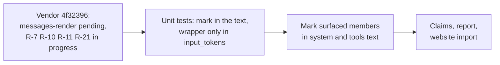

Then the fix, test-first. Three unit tests in `tests/test_messages.py` failed first: a surfaced pair in `system`, with a group id that needs escaping and a body that must stay unescaped inside the mark; a surfaced pair of granted tools in `tools`; and the counts, where each member's `included[].tokens` is its body alone while `result.input_tokens` adds the wrapper's tokens for each member. `Messages.render` now builds the marked text and leaves the body it reports for per-item counts unchanged. Mutations were each caught: an unescaped group id and a mark only in `system`, by the unit tests alone, since `messages-render`'s group id needs no escaping and its tools have no conflict; the wrapper counted in the member's body, by the count test and the case; and a mark without its `conflict` key, by both mark tests and the case.

The README's step 4 now also leaves `recovery.detail` out of the trace comparison, and the TypeScript and Go runners already do. `cwa.conformance.comparable` drops it from a copy of each trace and still compares the rest of `recovery`. `tests/test_report.py` pins both halves: an expected trace that carries a detail still passes, and a changed `recovery.action` still fails at `/recovery/action`. No case carries a detail and this assembler never writes one, so no outcome changed. Mutations were each caught: ignoring all of `recovery`, comparing the detail again, and removing it from the caller's trace rather than from a copy.

Result: 58 of 58 cases pass and 24 of 24 rejection cases are rejected, and every checkable requirement is claimed again: 11 implemented and 14 boundary-checked.

**Contract update (2026-09-30): website `ec600d8`.** R-16 now says an assembler must not accept a tokenizer the application supplies under the ID of a tokenizer `conformance/README.md` publishes: it stops before assembly, with no payload and no trace, so a trace that names a published tokenizer always means its published count. The README adds that this holds for a published tokenizer the implementation does not provide itself, and that each implementation tests it itself, since no case can supply a tokenizer of its own. It also restates the corpus's profile id rule as the cases keep it: a case's profile takes the case's id or an id no other case uses. The spec keeps "refuse" for an assembly that ends in a trace, so this is a stop before assembly, like a rejected snapshot (R-17), not a refusal. This assembler already stopped: since M11, `Snapshot.from_json`, which `Snapshot.freeze` calls, raises `ValueError` for a caller's tokenizer under a built-in id before it reads the snapshot, so no `Snapshot` exists to assemble, and the built-in tokenizers are the two the README publishes, `fixture-whitespace/v1` and `estimate-utf8/v1`. `status.json` now cites `tests/test_tokenize.py::test_a_caller_cannot_redefine_a_built_in_tokenizer` for R-16. Re-vendored, every case passed and every rejection case was rejected without a code change.

Unit tests now pin the rule against the README rather than a copy of its list. The redefinition test takes its ids from the README's Tokenizers and renderers section, the bullets that count, and runs through both `Snapshot.from_json` and `Snapshot.freeze`. `test_the_built_in_tokenizers_are_the_published_ones` compares that list with the built-in ids, since the check compares with those, so a tokenizer the README publishes later fails the suite on the vendor commit until the check covers it. Mutations were each caught: `freeze` dropping the caller's tokenizers, a check that covered only `fixture-whitespace/v1`, and a README that listed a third tokenizer.

The review behind those tests found one way around the check. It compared the caller's keys with the built-in ids, but the trace names a tokenizer by the object's own `id`, so a tokenizer passed as `{"caller/v1": t}` with `t.id == "fixture-whitespace/v1"` was accepted, and a snapshot declaring `caller/v1` produced a trace naming `fixture-whitespace/v1` beside a character count. The fix, test-first: a key must be its tokenizer's `id`, or `from_json` raises `ValueError` before it reads the snapshot, as it does for a built-in id. That also stops a trace naming a caller's tokenizer the snapshot does not declare. `tests/test_tokenize.py::test_a_caller_tokenizer_is_accepted_only_under_its_own_id` failed first, through both entry points, for each published id and for another caller id. Mutations were each caught: dropping the check, and checking only ids that are built in.

Result: 58 of 58 cases pass and 24 of 24 rejection cases are rejected, and every checkable requirement is still claimed.

**Contract update (2026-09-30): website `4576fb5`.** R-16's clause from `ec600d8` now covers renderers too: an assembler must not accept a tokenizer or renderer the application supplies under the ID of one `conformance/README.md` publishes. It stops before assembly, with no payload and no trace, so a trace that names a published tokenizer or renderer always means its published count or rendering. The README adds that an application may hand an assembler a renderer of its own, though it then renders with one no case covers, which §1 does not allow a conformant application, and that the stop holds for a published renderer the implementation does not provide itself. The published renderers are the two the README's Tokenizers and renderers section lists, `fixture-xml/v1` and `cwa-messages/v1`, which are the two built here. This assembler did not comply. `Snapshot.from_json` and `Snapshot.freeze` took `renderers=` as the whole renderer registry, published ids included, so `renderers={"fixture-xml/v1": r}` put the caller's `r` under a published id, and the trace named a renderer by the object's own `id` whatever key it came under. No case can supply a renderer, so re-vendored, every case passed and every rejection case was rejected without a code change, and only the lock's website commit changed in the report. `status.json` held R-16 in progress until unit tests covered the renderer clause. The plan follows the tokenizers' (`1cc120a`):

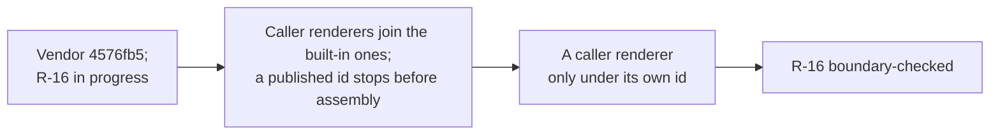


**M13 status (2026-09-27): done. Second implementation.** The TypeScript assembler (`@contextwindowarchitecture/assembler`, repository assembler-typescript) is built from the vendored contract alone, under a standing rule never to read this assembler, and passes every published case: 52 of 52, and 22 of 22 rejection cases, at website `591f7eb` (its commit `a7d6b82`). The website imports its report beside this one and shows both in the matrix. The alignment review that closed the gate also showed what a second implementation is for: two behaviours the spec left open, on which the two disagreed while both passed every case (the contract updates above, D-22 and D-23), are now each written into the spec with a case that pins them. Every release gate (M11–M14) is met; the release itself (D-18) is the maintainer's call.

**M14 status (2026-09-23): done. Release hygiene.** The maintainer chose Apache-2.0 for both repos, CI with a Python and Node version matrix and a contract-drift check, a CHANGELOG generated from the Conventional Commit history, and a benchmark script plus a deterministic count of tokenizer calls. Done so far: the license (assembler `4f7d934`, website `58d4e5e`), and `py.typed`. Before shipping the marker, mypy found 20 errors, from unannotated containers to Optionals the code guarded without telling the checker. `1855d78` fixes them with no behavior change, and `tests/test_packaging.py` runs mypy in the suite, so the promise `py.typed` makes holds at every commit. The benchmark is `scripts/bench.py`, with its numbers in §7, and `tests/test_scale.py` pins linear tokenizer calls; a mutation that counted every body in each fit test was caught. It found that the characters tokenized grow quadratically under heavy shedding (§7), which is reported for a decision rather than optimized here. CI runs the suite on Python 3.11 to 3.14 and checks the vendored contract against a checkout of the locked website commit; actionlint passes both repos' workflows. Running the matrix locally first found a real bug: on Python 3.11 the package did not import, because a dataclass default was a `MappingProxyType`, which 3.11 rejects as unhashable. `7d0a14a` fixes it. The CHANGELOG is generated by git-cliff from the Conventional Commit history, grouped by type (`cliff.toml`). Since a commit cannot list itself, it is regenerated at a release rather than in every commit, and AGENTS.md says so. Of the release gates, only M13 remains.

**M12 status (2026-09-23): done. Invalid-snapshot rejection** (R-17). The maintainer took the recommended option on all four questions (D-20). Rejection, not refusal: M0's `SnapshotError` already matched the conformance README, so M12 mostly made it normative and testable. Spec first: website `03e56b8` amends R-17 and gathers the checks into README Snapshot checks. That includes one rule this assembler enforced but the spec never stated, a producer heading at most one batch, which a port could otherwise have skipped and still passed every case. It also adds `checkSnapshot` to the website's `contract.js`, a JavaScript reference for every check. `fd24188` and `ffcc379` add the report's `rejections` list, with outcomes `rejected`, `failed` or `skipped`; `failed` was first called `accepted` until a crash showed it needed the same word assembly cases use. `a50f31f` adds fourteen rejection cases, one per check. Here `run_rejection` reports them, the status gate counts a rejection case only when it is rejected, and `tests/test_rejections.py` checks each. Mutations were each caught: dropping the producer check, and a report marking a rejection failed.

Result: 44 of 44 cases pass and 14 of 14 rejection cases are rejected, and every checkable requirement is still claimed.

**M11 status (2026-09-23): done. Pluggable tokenizer** (R-16, R-17, R-21). The maintainer took the recommended option on all four questions (D-19). Spec first: website `77ba261` adds the optional `budget.margin_percent`, `4b13043` defines `estimate-utf8/v1`, and `a3ad837` adds three cases. The margin is built: `Budget.charged` applies it in fitting's one fit test, which the protected-content and slot-floor refusals share, and the trace's budget repeats it. `estimate-utf8/v1` is built as `cwa.tokenize.EstimateUtf8`, so all 44 cases pass and R-16 and R-21 are claimed again; a mutation counting code points instead of bytes was caught. Callers pass their own tokenizers to `Snapshot.from_json` or `Snapshot.freeze` as `tokenizers=`. They join the built-in ones for that call only, and a built-in id cannot be redefined, since the spec fixes what it counts. That is the one choice the maintainer did not make, taken because a spec-defined id must count alike everywhere. `cwa.Tokenizer` is now exported and runtime-checkable, and it needs only `id` and `count`: the unused `exact` and `margin` attributes are gone, since the budget holds the margin. A mutation that let caller tokenizers replace the built-in ones was caught. `examples/tiktoken_tokenizer.py` is the exact adapter, outside `src/cwa` so the purity guard still bans tiktoken there. The caller loads the encoding before freezing, and the adapter counts special-token text in untrusted bodies as ordinary text rather than letting tiktoken raise. `tests/test_examples.py` checks it against a fake encoding, so the suite needs neither tiktoken nor a network; a mutation that dropped `disallowed_special=()` was caught.

Result: all 44 vendored cases pass, and every checkable requirement is claimed again: 17 implemented and 8 boundary-checked. A real route can now be assembled, either exactly with a caller's tokenizer or by estimate with `estimate-utf8/v1` and a margin. Unit tests pin what the cases leave open: rounding up (57.2 charges 58), counts in the trace that stay unscaled, a budget without a margin that traces none, and item and slot caps that ignore even a 100% margin. A mutation that rounded down was caught.

**M10 status (2026-09-23): done. Slot floors** (R-16, R-17). The maintainer took the recommended option on all four questions (D-16): a hard floor that refuses with the new `slot_floor_over_budget`, a slot that freezes at its first withheld reduction, R-16's tier-order exception for droppable items a floor holds, and amendments to R-16 and R-17 rather than a new requirement. Spec first: website `3856762` adds `slots.<slot>.min_tokens`, the refusal code and the Fitting rules; `a8530ee` adds three cases, vendored here as pending, with the requirements they tag (R-16, R-17, R-18, R-21) held at *in progress* until they passed.

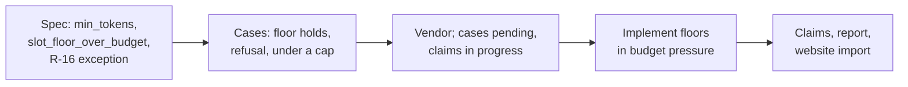

Result: all forty vendored cases pass, and the four held claims are back, so every checkable requirement is claimed: 17 implemented and 8 boundary-checked. The floor rules are in §4.4. Unit tests pin what the cases leave open: a withheld compression freezes its slot too, a reduction that lands exactly on the floor is made, a floor counts every occurrence of a slot placed twice, a frozen slot keeps a smaller reduction that alone would have held the floor, and protected content over budget is reported before a floor. A new property (P9, §6) checks floored slots on generated routes. Mutations were each caught: floors guarding slot caps, skipping instead of freezing, an exclusive floor, no floors, the wrong refusal code, a refusal that drops its fitting rows, compression left unchecked, and a floor measured one occurrence per item. The last two first survived; tests for a withheld compression and for a slot placed twice now catch them.

**M9 status (2026-09-23): done. Route-requested source diversity** (R-26). The maintainer took the recommended option on all four questions (D-15): a source is one authenticated producer and one `source`, a hard cap as its own stage after dedupe, exempt items fill places first, and a new requirement. Spec first: website `ab46b9b` adds R-26, `slots.<slot>.max_per_source` and the `source_diversity_cap` reason, tells retrievers to set `source` to the document, and widens the report schema to R-26; `6ba14c0` adds three cases, vendored here as pending, with R-26 and every requirement they tag (R-6, R-11, R-12, R-13, R-15, R-16, R-17, R-21, R-22, R-24, R-25) held at *in progress* until they passed.

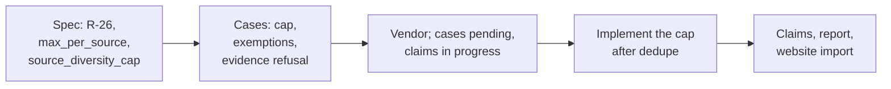

Result: all thirty-seven vendored cases pass. `status.json` claims R-26 implemented and the eleven held claims are back, so every checkable requirement is claimed: 17 implemented and 8 boundary-checked. `src/cwa/diversity.py` is §4.2. Unit tests pin what the cases leave open: the cap holds with a huge budget, a source at or under the cap is untouched, a slot with other rules but no cap is not capped, and a source with more exempt items than the cap keeps no other item. A new property (P8, §6) checks every capped slot against an oracle. Mutations were each caught: a source keyed by `source` alone, exempt items taking no places, no floor at zero on the places left, no group or protected exemption, the lowest-ranked items kept, and the cap before dedupe. The zero-floor mutation was caught only by the exempt-over-cap test, written for it before the mutation run.

**M8 status (2026-09-23): done. Route-requested supersession of stale observations** (R-25). The maintainer took the recommended option on all four questions (D-14): a call is one authenticated producer and one `source`, opt-in on any slot, ties for the latest instant all stay, and a new requirement. Spec first: website `a752d91` adds R-25, `slots.<slot>.supersede: "source"`, the `superseded` reason and `excluded[].superseded_by`, and widens the report schema to R-25; `13d4ff9` adds three cases, vendored here as pending, with R-25 and every requirement they tag (R-2, R-6, R-11, R-12, R-15, R-16, R-17, R-21, R-22, R-24) held at *in progress* until they passed.

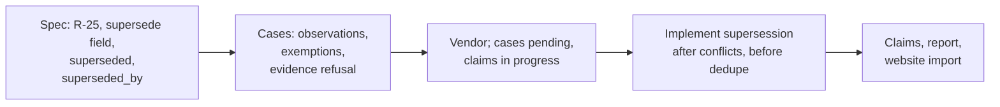

Result: all thirty-four vendored cases pass. `status.json` claims R-25 implemented and the ten held claims are back, so every checkable requirement is claimed: 16 implemented and 8 boundary-checked. `src/cwa/supersede.py` is §4.2. Unit tests pin what the cases leave open: instants differing only in the seventh fractional digit, equal instants spelled with other offsets and precisions, another producer's later item with the same source, bodies and `source_version` ignored, a conflict loser that never supersedes, and `superseded_by` naming the highest-ranked latest item whichever spelling of the instant it has. A new property (P7, §6) checks every superseding slot against an oracle. Mutations were each caught: a call keyed by `source` alone, freshness compared as text, ties superseded, no group or protected exemption, the lowest-ranked latest item named, slots superseded that did not ask, and supersession before conflicts. One mutation first survived, matching the latest items by timestamp text, because the first tied item was always the highest-ranked; the ranked-tie test now catches it.

**M7 status (2026-09-23): done. Route-requested exact deduplication** (R-24). The maintainer took the recommended option on all four questions (D-13): opt-in per slot, whitespace-only keys, after conflict resolution with exemptions, and a new requirement. Spec first: website `a664ddb` adds R-24, `slots.<slot>.dedupe: "exact"`, the `duplicate_content` reason and `excluded[].duplicate_of`; `ff333f1` adds three cases; and `d2e8bd6` fixes the conformance-report schema, whose rule pattern stopped at R-23. The cases were vendored here as pending, with R-24 and every requirement they tag (R-6, R-11, R-12, R-16, R-17, R-21, R-22) held at *in progress* until they passed.

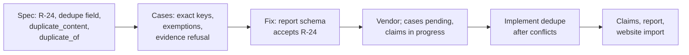

Result: all thirty-one vendored cases pass. `status.json` claims R-24 implemented and the seven held claims are back, so every checkable requirement is claimed: 15 implemented and 8 boundary-checked. `src/cwa/dedupe.py` is §4.2. Unit tests pin what the cases leave open: only ECMAScript whitespace collapses (U+2028 and U+205F do; U+200B and U+001C, which Python's `\s` matches, do not), a slot with other rules but no `dedupe` keeps equal bodies, variants are ignored, a conflict loser never counts as the kept copy, and a conflict refusal keeps the dedupe rows. A new property (P6, §6) checks every deduplicated slot on generated routes. Mutations were each caught: Python's `\s`, NFC normalization, no group or protected exemption, keeping the lowest-ranked copy, deduplicating slots that did not ask, and deduplicating before conflicts. One mutation first survived, deduplicating every slot the route configures, because no test gave a slot other rules without `dedupe`; a test now does. Two things changed outside dedupe: `ranked()` in `fitting.py` became public for reuse, and the website build and tests now derive the requirement count instead of assuming 23.

**M6 status (2026-09-23): done. Per-slot route budgets** (R-3, R-16, R-17). The maintainer asked for the per-slot allocations M2 deferred to be planned and built, as a ceiling only, with a protected item that pushes its slot over the cap refusing under the existing `protected_content_over_budget` (D-12). Spec first: website `e01eb52` adds the route field `slots.<slot>.max_tokens`, the R-3 and R-16 text and a new Fitting step, and `0526686` adds three cases, vendored here as pending. `tests/test_status.py` rejects a claim while a case tagged with it fails, so while the cases were pending `status.json` held the requirements they tag (R-3, R-16, R-17, R-18, R-21 and R-22) at *in progress*.

```mermaid
flowchart LR
  S["Spec: max_tokens,<br/>R-3 and R-16 text,<br/>Fitting step 3"] --> C["Cases: slot caps,<br/>cap before pressure,<br/>protected over slot cap"] --> V["Vendor; cases pending,<br/>claims in progress"] --> I["Implement slot caps<br/>in fitting.py"] --> R["Restore claims,<br/>report, website import"]
```

Result: all twenty-eight vendored cases pass, and the six claims are back, so every checkable requirement is claimed again: 14 implemented and 8 boundary-checked. The slot-cap semantics are in §4.4. Beyond the cases, unit tests pin a slot exactly at its cap, a slot without one, slot shedding order, a route step inside a slot cap and, with the message renderer, a slot size that sums each occurrence's own rendering. A new property (P5, §6) checks every capped slot on generated routes. A targeted mutation of each rule (one occurrence counted, no caps, caps in name order, caps after budget pressure, no protected refusal) was caught. One choice the build forced is now in the spec: a slot's size is the sum of `included[].tokens`, not the largest rendering that item caps use, because a slot cap bounds a share of the payload rather than one body.

**M5 status (2026-09-22): done. Hardening** (R-21, R-22, R-23). The maintainer took the recommended option on all four open questions (D-7 to D-10, §9), and on D-11, which the work turned up. Spec first again: each spec change lands in the website, is vendored, and fails here before it is implemented.

```mermaid
flowchart LR
  H["Assembler-only hardening<br/>purity, replay, import lint,<br/>reason coverage"] --> O["Spec: UTF-16 order<br/>+ astral-id case (D-7)"] --> OI["Implement order"]
  OI --> D["Spec: snapshot digest (D-10),<br/>eligibility in included[]"] --> DI["Implement,<br/>compare digests"]
  DI --> T["Injected clock,<br/>timings (D-9)"]
  T --> R["Spec: conformance report<br/>schema + matrix (D-8)"] --> RI["Runner, committed report,<br/>status gate"] --> S["status.json R-21..R-23,<br/>website import"]
```

- **Order (D-7), done.** Wherever the spec orders strings, it compares UTF-16 code units, as RFC 8785 already orders member names (website `3b9bb51`). Only ids with characters outside the Basic Multilingual Plane notice. `cwa.strings.utf16` is the sort key at every site: snapshot normalization, placement, admission, conflict and fitting rows, and the id tie-break in shedding. `ordering-astral-ids` (website `78a9d10`) passes.
- **Blank strings, done.** A trap found on the way: R-2's "non-blank" was undefined, and the schemas' `\S` pattern reads differently in JavaScript and in Python's `re` at U+001C–U+001F and U+FEFF. The spec now defines blank by the ECMAScript whitespace set and spells that set out in every pattern (website `4f465ca`). `cwa.strings.blank` decides usable ids.
- **Timestamps (D-11), done.** `format: date-time` is library-defined: ajv-formats accepts a space for `T`, offsets without a colon and second 60, and Python's `rfc3339-validator` a trailing newline. The maintainer chose a portable profile without leap seconds: every date-time also carries an explicit pattern, and digests bound their length (website `b8fd56a`). `cwa.instants` parses only that profile.
- **Snapshot digest (D-10), done.** The spec defines the normalization and RFC 8785 serialization this assembler already used (website `52c9c5d`). Every expected trace carries the digest, the website recomputes it in JavaScript, and conformance here compares it. A snapshot string with an unpaired surrogate, which RFC 8785 cannot serialize, is a `SnapshotError`.
- **Eligibility, done.** `included[]` rows carry the item's `eligibility` after defaults and route overrides are filled (website `ce40ef5`, R-22).
- **Timings (D-9), done.** `assemble(snapshot, clock=...)` takes an optional monotonic clock in seconds from the caller and records `admission_ms`, `conflicts_ms`, `supersede_ms` (from M8), `dedupe_ms` (from M7), `diversity_ms` (from M9), `fitting_ms` (refusal checks and fitting) and `render_ms`. Without one, the trace has no `timings` and assembly reads no clock; the purity test runs both ways. A clock that runs backwards records 0.
- **Conformance report (D-8).** A schema'd, language-neutral `conformance-report.json` records each case's outcome (website `c9027ec`). `python -m cwa.conformance` writes it, this assembler commits it beside `status.json`, and a test fails when it is stale. `tests/test_status.py` rejects an *implemented* or *boundary-checked* claim while a case tagged with its rule fails in the report. The website imports it beside `status.json` (website `d70e14b`), and its matrix shows each requirement's passing cases, counting a case published after the last run as not passing.

Result: all twenty-five vendored cases pass, and `status.json` claims R-21, R-22 and R-23 implemented, so every checkable requirement is claimed: 14 implemented and 8 boundary-checked. Beyond the plan, M5 found and closed three cross-language traps (blank strings, timestamps, unpaired surrogates) and a Python `$` anchor that let a trailing newline through two checks. The hypothesis property tests followed (§6).

**M4 status (2026-09-22): done. Placement, profiles, the message renderer and the registry** (R-7, R-19, R-20). The maintainer chose the render IR (below) and asked for the two example profiles a single system prompt cannot realize to be revised to version 3, which website `1a6ede5` did. Spec first again: website `16a5cca` defines the placement checks and `b303ca4` adds three placement cases, vendored here as pending.

```mermaid
flowchart LR
  P1["Placement spec<br/>website 16a5cca, b303ca4"] --> P2["Profile checks<br/>at the snapshot"] --> P3["slot_unplaced,<br/>protected_slot_unplaced"] --> R1["Render IR spec<br/>cwa-messages/v1"] --> R2["Message renderer<br/>R-7"] --> E["Example profiles v3"] --> G["Registry lock,<br/>deployment gate<br/>R-19, R-20"]
```

- **Profile checks happen with the snapshot** (R-20). A profile for another route, or one that does not place `governance.instructions`, `interaction.query` and, on a parser route, `governance.output_contract`, is a `SnapshotError`. It could never assemble, so it has no trace.
- **Placement is the last admission check** (R-20). An item in a slot the profile does not place is excluded with `slot_unplaced`, after every other check. A protected item is kept instead, and assembly refuses with `protected_slot_unplaced` right after `required_slot_missing`. Placement no longer raises `NotImplementedError`, and the three placement cases pass.
- **One body, two renderings.** A governance slot placed as both `system` (raw) and `xml:` (escaped), as `document-analysis` is, renders one body two ways. Caps and variant comparisons use the larger rendering, and each `compressed[]` row counts its own occurrence (website `3227b9a`).
- **Render IR (D-1), as chosen and built** (website `35b827e`, cases `c131acc`). `cwa-messages/v1` (`src/cwa/render/messages.py`) emits RFC 8785 JSON `{messages, system, tools}`. Only governance slots may use `system` or `tools` wraps (`tools` only for capabilities), and every `system` placement comes before every `xml:` placement; anything else is a `SnapshotError`. One user message holds every `xml:` occurrence in `fixture-xml/v1` grammar, with history turns marked `speaker="user"` or `speaker="assistant"` (from `lineage: generated`) and never split into their own messages (R-7). `input_tokens` is the sum of the tokenizer's counts of each system text, tool text and message content, so a renderer now declares the texts it counts (`Rendered.texts`). `included[]` follows placement order, which the spec now says explicitly, since the IR's sorted keys put `messages` before `system`. With it R-7 and R-10 are implemented: the `messages-render` case is also the injection case DA-6 asked for.
- **Registry** (website `dcb2319`, fixtures `ac55a4a`). `cwa.registry` loads profiles and route policies against a lock that pins each `(id, version)` or `(route, version)` to a digest. It refuses content that changed under an unchanged version, content the lock does not pin, and a lock or input that names an identity twice (R-20). A profile's digest leaves out `evaluation`, so promotion alone keeps the version, as R-20 allows. `lock()` adds new identities and never rewrites one. `profile(..., deployment=True)` returns only evaluated profiles, for which the profile schema demands a model family and a reproducible artifact (R-19). `conformance/registry/` pins the published example profiles; the website recomputes those digests in JavaScript, and the tests here in Python.

```mermaid
flowchart LR
  L[/"lock.json<br/>id, version, sha256"/] --> RG["Registry.from_json<br/>schema-valid, pinned,<br/>digest unchanged"]
  D[/"profiles,<br/>route policies"/] --> RG
  RG -- "changed, unpinned<br/>or duplicated" --> X["RegistryError"]
  RG --> P["profile(id, version,<br/>deployment=True)"]
  P -- unevaluated --> X
  P --> S["Snapshot.freeze(profile=…,<br/>route_policy=…)"] --> A["assemble()"]
```

Result: all twenty-four vendored conformance cases pass, and `status.json` claims R-7, R-10 and R-20 implemented and R-19 boundary-checked. The build diverged from the original design in four ways, each written into the spec:

- **`Registry.from_json(lock, profiles, route_policies)`**, not `Registry.from_lockfile(path)` (§2.2). The registry reads documents, not files, like `Snapshot.from_json`, so the application owns all I/O. The lock pins route policies as well as profiles.
- **Placement is an admission check.** The old step 5 ran after conflicts; the built check runs last in admission, so an unplaced item never joins a conflict group, and a group it would have joined can become moot.
- **The payload's size is a renderer's business.** A text renderer counts its payload, and `cwa-messages/v1` sums its texts, so JSON punctuation and role names are never counted.
- **`included[]` is in placement order**, which for a text renderer is the same as payload order.

**M3 status (2026-09-22): done. Conflicts** (R-6, R-11, and the last clause of R-3). As in M2, the spec came first. Website `89660ed` defines resolution, and `271f4c3` adds five conflict conformance cases generated from intent tables, vendored here as pending. The maintainer took the recommended option on each open question:

- **Instruction groups (DA-7).** Deciding by authority excludes nothing. Among two or more peers at the top instructing authority, one `governs` and the rest `defers` excludes the deferring peers with `conflict_deferred`. Any other pattern escalates.
- **`conflicts[].resolution`** is a closed vocabulary tied to `decided_by` (`resolved`, `surfaced`, `context_requested`, `refused`, `moot`), with an optional `winner`.
- **`surface`** marks each member's occurrence in `fixture-xml/v1` with `conflict="<group id>"`. No existing hash changes, because snapshots with groups could not be assembled before.
- **R-7 moves to M4.** Its history-transcript and live-user-turn clauses need the D-1 message renderer, which M4's profile wraps need anyway. M3 covers only "no authority from wording", through conflicts and escaping.

These defaults went into the spec with them:

- Fact policy is `facts.<key>`: `precedence` (authenticated producer ids), `scope`, `freshness_tiebreak` and a required `on_unresolved`.
- `on_unresolved_instruction` defaults to `refuse`.
- No conflict excludes a protected item; such a group escalates.
- An item belongs to at most one group.
- Unknown ids, shared items and undefined facts are `SnapshotError`s.
- Conflicts resolve right after admission, so every trace records them, refused or not.

```mermaid
flowchart LR
  S1["Spec<br/>website 89660ed"] --> S2["Cases<br/>website 271f4c3"] --> V["Vendor<br/>68882a7"] --> C1["Snapshot<br/>group checks"] --> C2["Instruction<br/>groups"] --> C3["Fact<br/>groups"] --> C4["Escalation,<br/>refusal, marks"] --> ST["status.json<br/>R-6, R-11"]
```

Result: `src/cwa/conflicts.py` resolves every group kind and every escalation action (§4.3), and all nineteen vendored conformance cases pass byte for byte. `status.json` now claims R-3 and R-6 implemented and R-11 boundary-checked. It diverged from the old §4.3 in four ways, each written into the spec:

- **Protected items are never excluded by a conflict, in fact groups as well.** The old design protected only deferring instruction peers. A fact decision that would drop protected content escalates too, so the required-slot check stays sound.
- **Eligibility is explicit.** A fact member is eligible only when its authenticated producer is listed in `precedence` and it carries the policy's `scope` keys. Ineligible members cannot win, and they are excluded when another member does.
- **Conflicts resolve before every refusal check**, not after the required-slot check. Every trace records them, including a `required_slot_missing` refusal.
- **Group checks happen at the boundary.** Overlapping groups, unknown ids and undefined facts are `SnapshotError`s, so no outcome depends on the order groups are processed in.

**Stabilization (2026-09-22).** A housekeeping pass before M4 found three things, now fixed. Two candidates sharing an id could move the snapshot digest with input order. The order test never actually reordered items. And the purity test swallowed `NotImplementedError` for every case, not only pending ones. It also found the documentation drift this section and §2–§6 now correct.


**M2 status (2026-09-22): done.** Budget fitting and refusal are implemented test-first, spec first. The website gained the route-policy fields (`c0f5890`), `excluded[].slot` (`574fc6d`), and nine budget and refusal conformance cases generated from intent tables (`9e40504`). All eleven vendored cases pass byte for byte. Three followed: `budget-route-tiers` (website `d84bbd8`) closed a gap in the R-16 claim, since no test showed fitting honor a tier the route raised; `budget-token-caps` and `protected-over-cap` (website `adae6e1`) cover caps. `status.json` now claims R-4, R-12, R-16 and R-17 implemented and R-18 boundary-checked. Fitting is §4.4, refusals are §4, and the recovery mapping is §4.5. It diverged from this document in six ways, each written into the spec:

- **No `invalid_snapshot` refusal.** A snapshot that fails its schema is rejected before assembly and has no trace. Refusal precedence is `contract/reasons.json` order, and `conflict_unresolved` moved ahead of the budget refusals to match the pipeline.
- **Protected content is checked before shedding.** When it can't fit, the refusal has no `over_budget` rows.
- **"Fits" is always a whole-payload render and count.** The estimate-then-correct loop in the old §4.4 is gone. An implementation may estimate only if it reaches the same decisions.
- **The fitting policy has a closed vocabulary.** Per-slot `priority` (lower sheds first, ties by slot name) and `order_by` (`-relevance`, `-freshness`, `freshness`; `id` is always the last key), and a route `fitting_order` of `compress`/`omit` steps. `min_included` is accepted only on evidence slots of a route that requires evidence.
- **Recovery is chosen by what was omitted for budget**, not by whether producers returned candidates (§4.5).
- **Per-item `token_budget` caps came after the milestone closed.** The spec left them undefined, so the first M2 build ignored them. Option A is now in the spec (website `d80342d`) and built: caps apply before shedding, and a protected item over its cap refuses. R-3 now says `null` sets no per-item cap. Per-slot route allocations were deferred then, and M6 built them as `max_tokens`.

**Follow-up for M5 (done, D-7):** trace and placement ordering compared ids by code point, while JavaScript's default sort uses UTF-16 code units. They differ only for ids with characters outside the Basic Multilingual Plane. The spec now orders every string by UTF-16 code units (website `3b9bb51`, case `ordering-astral-ids` in `78a9d10`), and `cwa.strings.utf16` is the one sort key.

**M1 status (2026-09-22): done.** Admission is implemented test-first as an ordered table of checks in `src/cwa/admission.py`, and the website's `admission-reasons` conformance case (42 candidates) passes byte for byte. `status.json` records the result: R-1 and R-2 are implemented, R-8, R-9, R-13, R-14 and R-15 are boundary-checked, and eight more requirements are in progress. It diverged from this document in five ways, each now written into the spec:

- **Precedence comes from the registry.** The check order is the order of `contract/reasons.json` (R-21), not the table in §4.1. The producer check comes *first*: a batch from a producer the route doesn't list is refused before anyone reads its items. Several missing fields tie-break alphabetically.
- **Snapshots carry raw items.** Validating items in the snapshot schema would have rejected a whole snapshot for one bad item, against R-2. Items without a usable id are recorded as `{producer}#invalid-{n}`.
- **Route-policy fields are portable.** `max_age_seconds` and `source_prefix` replace the ISO durations and regex patterns in §3.1, because neither parses identically in JavaScript and Python.
- **State producers only.** State slots admit only producers of kind `state`, whatever the route lists (R-8).
- **Unscored items fail thresholds**, and all limits are inclusive.

`parser`, `requires_evidence`, `min_included`, fitting order and fact policies are not in the route-policy schema yet; they arrive with M2 and M3.

**M0 status (2026-09-22): done.** The skeleton reproduces `examples/payload.txt` byte for byte (SHA-256 `4cf0b083…`, 34 tokens) from the first conformance case. It vendors the contract with a SHA-256 lock, validates snapshots with format checking on, uses order-independent snapshot digests (RFC 8785), escapes bodies, and has purity guards. Two deviations from §2.2: `Snapshot.freeze(**fields)` takes JSON-shaped values that follow `snapshot.schema.json` rather than dataclass instances, so there is one validation path; and an unassemblable snapshot raises `SnapshotError` before assembly instead of emitting an `invalid_snapshot` refusal, which has no registered reason code yet. Anything M0 can't do faithfully (admission, fitting, conflicts) raises `NotImplementedError`. No matrix row flips at M0.

---

## 9. Open decisions

| ID | Decision | Status |
|---|---|---|
| D-1 | What is "the payload"? (DA-1) | **Decided 2026-09-22:** canonical JSON of a render IR `{system, tools, messages}`. Text renderers (like the fixture) emit plain UTF-8. |
| D-2 | Can compressible items be omitted after compression? (DA-3) | **Decided and applied 2026-09-22:** Option B. The route orders variant-vs-omission, and the default is variants first. R-12 adds the route evidence minimum (`min_included`). See Appendix A. |
| D-3 | Tokenizer strategy (DA-2) | **Decided 2026-09-22:** local exact tokenizer, or an estimator with a declared margin recorded in `context.tokenizer`. Remote verification only after assembly; overflow → new snapshot. |
| D-4 | Are conformance *test cases* part of the spec or of the implementation? The implementation itself lives in `cwa-assembler`. | **Decided 2026-09-22:** website repo, beside `examples/`; `cwa-assembler` vendors them by hash. Layout lands with M0, together with a snapshot schema. |
| D-5 | History assistant turns (DA-22) | **Decided and applied 2026-09-22:** prior model turns are identified by `lineage: generated` (no schema change) and carry `untrusted` (R-1); every prior turn renders inside the history wrapper as a transcript, never as platform messages (R-7). |
| D-6 | Bundle the schema amendments (DA-9, 10, 13, 14, 18, 24) into one draft revision in the website repo | **Applied 2026-09-22** before M0. See the spec page changelog, 2026-09-22 "budget, trace & history". |
| D-7 | How are strings ordered? (M2 follow-up) | **Decided 2026-09-22:** UTF-16 code units everywhere, as RFC 8785 orders member names. |
| D-8 | What is `conformance-report.json`? | **Decided 2026-09-22:** a website schema for per-case outcomes, emitted by each implementation's runner and imported into the matrix beside `status.json`. |
| D-9 | How does a pure core record R-22 timings? | **Decided 2026-09-22:** an optional caller-supplied clock; no clock, no timings. |
| D-10 | Is `context.snapshot_digest` portable? | **Decided 2026-09-22:** yes. The spec fixes the snapshot normalization and RFC 8785 serialization, and conformance compares the digest. |
| D-11 | Which timestamps are valid? (found in M5) | **Decided 2026-09-22:** RFC 3339 §5.6 without leap seconds, ASCII digits, colon offsets up to ±23:59, enforced by a pattern beside `format: date-time`. |
| D-12 | How does a route cap a slot's share of the payload? (M6) | **Decided 2026-09-22:** `slots.<slot>.max_tokens`, a ceiling only; floors were deferred then and built in M10 (D-16). It holds whether or not the payload fits, after item caps and before budget pressure, and the slot sheds only its own items in tier order. Protected items alone over it refuse with `protected_content_over_budget`, so no new reason code. It is named `max_tokens` rather than the `token_budget` first proposed, because `default_overrides.<slot>.token_budget` already sets each item's default cap. |
| D-13 | How does the assembler deduplicate? (M7) | **Decided 2026-09-23:** only in the slots a route opts in with `slots.<slot>.dedupe: "exact"` (an enum, so `"cluster"` can follow when producers emit cluster ids). A body's key collapses whitespace runs to one space and trims the ends, with no Unicode normalization or case folding, because runtimes ship different Unicode versions. It runs after conflict resolution and before refusal checks, never compares across slots, and never excludes a protected item or one a conflict group names, so a group cannot go moot while an ungoverned copy survives. Otherwise the highest-ranked copy stays, and `excluded[].duplicate_of` names it. It is a new requirement, R-24, the first appended after the original numbering. |
| D-14 | How are stale observations superseded? (M8) | **Decided 2026-09-23:** only in the slots a route opts in with `slots.<slot>.supersede: "source"` (an enum, so a producer call key can follow). A call is one authenticated producer and one exact `source`: `source` alone is item-controlled, and R-15 forbids trusting it, so a producer supersedes only its own items. Within a call, every item older than the latest `freshness` (instants at full precision) is excluded as `superseded`, with `superseded_by` naming the highest-ranked latest item; items tied for the latest all stay. It runs after conflicts and before dedupe, with dedupe's exemptions. It is a new requirement, R-25, rather than a clause of R-24, because it rests on staleness, not identical text. |
| D-15 | How does a route keep one source from dominating a slot? (M9) | **Decided 2026-09-23:** `slots.<slot>.max_per_source`, an integer of at least 1. After dedupe and before any refusal check, whether or not the payload fits, each pair of authenticated producer and `source` keeps at most that many items and the rest are excluded as `source_diversity_cap`. Protected and conflict-grouped items are never excluded and take places first; the others fill what is left in the slot's rank. A hard cap rather than a fitting preference, so the outcome never depends on the budget. Producers must set `source` to the document, not the passage. A new requirement, R-26. |
| D-16 | What does a slot floor do? (M10) | **Decided 2026-09-23:** `slots.<slot>.min_tokens`, measured like `max_tokens`, guards budget pressure only. A reduction that would leave the slot below it is not made, and the slot freezes, so rank order within it holds. If the payload then does not fit, assembly refuses with `slot_floor_over_budget` after fitting, keeping the fitting rows. A hard floor, because slot priority already sheds a slot last. R-16's rule that droppable items all go first gains one exception, droppable items a floor holds. R-16 and R-17 are amended; no new requirement. |
| D-17 | Should producers supply a call key for supersession, or cluster ids for dedupe? (after M10) | **Decided 2026-09-23: neither yet.** A call key (`supersede: "call_key"`) would free `source` to name the server or tool a citation points to, but it needs a new item field, cross-language argument canonicalization and a second grouping branch, and no producer needs it: putting the call's subject in `source` works. Revisit when an MCP adapter needs `source` for citation. A cluster mode (`dedupe: "cluster"`) would collapse near-duplicates by a retriever-computed id, but the grouping cannot be checked from the snapshot, it cannot span producers without a shared clustering service, and a retriever that can cluster can drop its own near-duplicates. So retrievers now report each drop in their batch as `duplicate_content` with `duplicate_of` (R-13), which keeps every exclusion in the trace. Revisit when a clustering service spans producers. Both enums leave room. |
| D-18 | How are the spec and the reference tools versioned before release? (after M10) | **Decided 2026-09-23:** nothing is released, so the spec is labelled plain "draft", with no number, until its first release. That release is v1, shared by the spec, this assembler (1.0.0) and the other reference tools. Example profiles and route policies start again at version 1 (`policy-first-chat/v1`, `illustrative/v1`); profile versions stay integers, because R-20 requires a change to increment them. Profiles and traces name the specification they follow, as the site's About page promised: a profile carries `spec`, which its schema fixes to `cwa/draft` until the first release (then `cwa/1`), so a profile for another specification is rejected with the snapshot (R-19), and every trace repeats it as `context.spec` (R-21). Applied in website `19e2740` (label), `b91c156` (versions) and `6ff8657` (spec field). The release waits on M11–M14 (§8). |
| D-19 | How do real tokenizers plug in? (M11) | **Decided 2026-09-23:** an estimating tokenizer's headroom is an optional integer `budget.margin_percent` (0–100) in the snapshot, which the trace's budget repeats, rather than a suffix parsed from the tokenizer id, so no language has to parse a string. It charges only the whole-payload fit test: the count times (100 + margin) / 100, rounded up, in integer arithmetic. Caps and floors divide the payload rather than bound it, so they compare unscaled counts, and traced counts stay unscaled. The first real tokenizer is `estimate-utf8/v1` (UTF-8 bytes / 4, rounded up), defined in the spec so every port counts alike, with an exact tiktoken adapter as an example outside the pure core. Callers pass tokenizers in, with no module-level registry. |
| D-20 | What happens to an invalid snapshot? (M12) | **Decided 2026-09-23:** it is rejected before assembly, with no payload and no trace. R-21's trace needs a real profile, budget and context, which such a snapshot may lack, and building a snapshot wrongly is the application's bug, not an outcome the route decides. R-17 now says so, beside refusals, rather than in a new requirement. Rejections carry no registered code; each rejection case breaks exactly one check, so any rejection is the right one. Conformance tests them with `conformance/rejections/` and the report's `rejections` list. |
| D-21 | Should fitting stop recounting the whole payload for every reduction? (M14) | **Decided 2026-09-23: not for v1.** Characters tokenized grow quadratically when most candidates are shed (§7: 49 million for 500 passages, 0.35 s), but a faster fit must reach identical decisions in every language. Summing part counts would change what fits means for tokenizers that are not additive across parts, including `estimate-utf8/v1` and BPE. Binary search over a step would require that a payload's count never rises as items go, a new requirement on tokenizers. So the website documents the cost, and that shortcuts may not change a decision (website `31d4158`), and asks retrievers to send no more passages than the budget can use. Revisit with binary search if a real route needs thousands of candidates; it keeps today's decisions for well-behaved tokenizers. |
| D-22 | What makes a producer the route capability policy? (2026-09-27 alignment review) | **Decided 2026-09-27:** the producer the snapshot's `capabilities.policy_producer` names, listed by the route with kind `capability_policy`. A `governance.capabilities` item is authorized only from that producer's batch and only when the allow-list names it; anything else is `capability_not_allowed`, an exclusion rather than a rejection, as a producer listed with another kind is elsewhere (R-15). This assembler already applied the rule, the TypeScript port checked the id alone, and the spec had not chosen. Written into R-15, the README, `reasons.json`, the snapshot schema and `contract.js` (website `c3562e9`), with the `capability-policy-kind` case. |
| D-23 | How do integers beyond 2^53 compare? (2026-09-27 alignment review) | **Decided 2026-09-27:** every number in a snapshot is an IEEE 754 double (I-JSON), read as the nearest double before any comparison, so an integer beyond 2^53 compares everywhere as the value the digest already serializes. Rejecting such integers instead was not portable: JavaScript's `JSON.parse` has already rounded them, so a port could not tell. Written into R-2 and the README's Numbers section (website `591f7eb`), with the `threshold-beyond-2-53` case; this assembler rounds at the snapshot boundary. |

## 10. What to revisit as it grows

- **Near-duplicate clusters (D-17).** When a clustering service spans producers, add `dedupe: "cluster"` over a producer-supplied cluster id, beside exact keys rather than replacing them. Until then retrievers drop and report their own near-duplicates (R-13).
- **Producer call key (D-17).** When an MCP adapter needs `source` to name the server or tool a citation points to, add `supersede: "call_key"` over a new item field, with the key's canonical form fixed in the spec.
- **Optimal fitting.** If greedy shedding visibly wastes budget on real routes, consider a small DP over compressible variants. It would still be deterministic, but slower.
- **Request-intent tree** (spec "future work"). Eligibility predicates would bind to sub-intents, which changes `RoutePolicy.slots` into a tree.
- **Multi-turn caching.** Stable prefixes (governance, capabilities) could be cached by providers. A renderer that guarantees byte-stable prefixes across turns could expose `prefix_hash`.
- **Other language ports** start only after the conformance suite is language-neutral and passing in Python.

---

## Appendix A. Proposed R-16 amendment (D-2)

### A.1 The gap

Current R-16 orders two things: droppable before compressible, and protected never touched. R-17 says what happens when **protected** content can't fit: refuse. Neither rule covers the third case: droppable items are gone, every compressible item is at its smallest variant, and the payload is **still** over budget, while protected content alone would fit. The landing demo refuses in that case, but no requirement says to.

R-12 already assumes the missing step exists. Its recovery actions `retrieve_narrower` and `precompute_summary` only make sense if evidence can be lost to budget pressure.

### A.2 Proposed text

Changes in **bold**. The first two and last two sentences are unchanged.

> budget.input MUST be the maximum rendered input tokens after reserving budget.reserved_output from the model context limit. The assembler MUST count profile wrappers, separators, tool schemas and repeated slots with the declared tokenizer. **Under budget pressure it MUST shed in tier order: it MUST omit droppable items before reducing any compressible item, and it MAY then reduce compressible items by selecting supplied variants or by omitting items, in the order given by the route's versioned fitting policy with a stable tie-break. It MUST NOT compress, truncate or omit protected items. Each omission MUST be recorded in excluded with reason over_budget and stage assembler.** The slot defaults define minimum protection; item metadata or profiles MUST NOT downgrade protected slots. Repeated occurrences count and are traced separately.

One sub-choice sits inside the compressible step:

| Option | Wording | Effect |
|---|---|---|
| **A · Fixed phases** | "…then select the shortest adequate variants for compressible items, and only then omit compressible items." | Fully specified by the spec. But it compresses the *best* evidence and the whole history before dropping a weak passage. |
| **B · Route-ordered** (recommended, and the text above) | "…select variants or omit items, in the order given by the route's versioned fitting policy." | The route can say "omit passages below rank 10 before compressing history". Determinism still holds because the policy is versioned and in the snapshot (R-23). The reference assembler ships Option A as its **default** fitting policy, so routes that set nothing get the predictable behavior. |

### A.3 Ripple effects across the spec and site

| Location | Today | Change | Kind |
|---|---|---|---|
| R-16 (`contract/requirements.json` → `SPEC.md`, spec page, assembler page) | Text above, minus the bold | Amend | Normative |
| R-17 | Refuse when protected content can't fit | No text change. It becomes the *only* budget refusal, which is what it already appears to mean. | Clarified |
| R-12 | `retrieve_narrower`, `precompute_summary` | No text change. The budget path to `evidence_required` becomes reachable and defined. | Consistency gain |
| R-3, R-23 | Route allocation; versioned policy in snapshot | None. The fitting policy is one more versioned route field. | None |
| Trace schema / R-21 | `excluded[] {item_id, reason, stage}` | No required change: `over_budget` is a new reason value (add it to the DA-13 registry). **Optional:** add `slot` to `excluded[]` so a validator can check that no protected item was omitted for budget. | Additive |
| Spec §4.1 prose (`spec.html:244`) | "Compressible items may be replaced by a precomputed shorter variant… drops before it compresses" | "Compressible items may be replaced by a supplied variant or omitted, once droppable items are gone." | Editorial |
| §6.1 budget-pressure test (`spec.html:471`, `index.html:1096`) | "compression happens in tier order" | "shedding follows tier order: droppable, then compressible; protected never" | Editorial |
| `interaction.history` slot rule | "summarised into memory rather than truncated mid-thought" | Compatible if history items are whole turns omitted oldest-first. State that explicitly. | Editorial |
| Landing demo fit (`index.html:1505–1510`, tour copy `:1317`) | Refuses when compression is insufficient | Add the omission step. The demo refuses less and shows "omitted". | Behavior (demo only) |
| `contract/cwa.md:15` | "Use precomputed shorter variants" | "…then omit by route priority" | Editorial |
| Changelog | — | New entry | — |

**Compatibility.** No previously specified behavior changes. The old text never defined this case, so an assembler that refused here was improvising rather than conforming. Only the demo's behavior changes.

**The new risk this creates.** Omission is traced, but a route could quietly keep 2 of 30 passages and answer anyway. R-12 only catches the all-gone extreme. Mitigation: an optional route knob `slots.<slot>.min_included`. Below that count, the assembler refuses `evidence_required` with `recovery.action: retrieve_narrower`.
